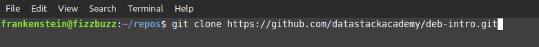
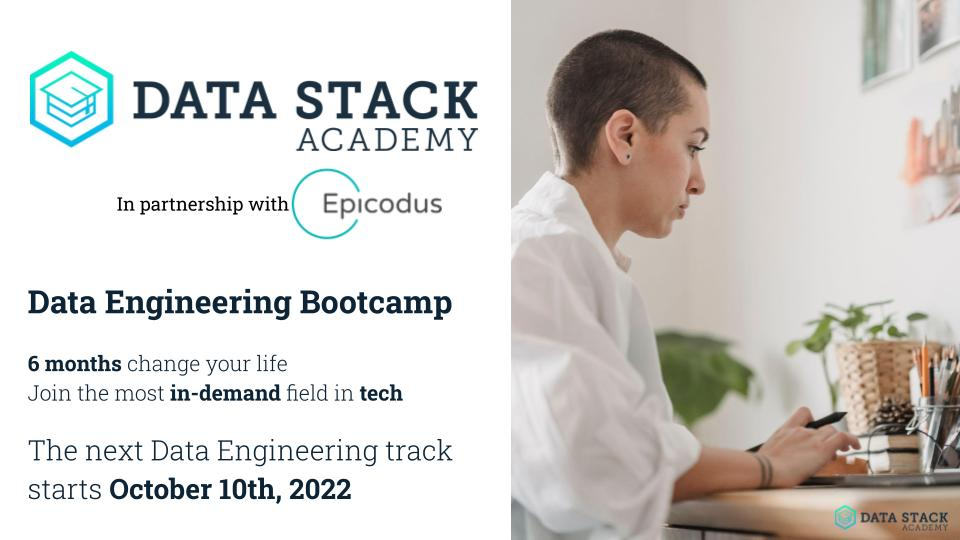

# Welcome to [Data Stack Academy](https://www.datastack.academy/)!


## The Data Engineering Hub

Welcome to the intro repository for Data Engineering Bootcamp! The full bootcamp curriculum contains seventeen chapters, taught over seventeen weeks. This public preview is limited to a modified version of the first two chapters of material.

Learn more about the course at [datastack.academy](https://www.datastack.academy/).

## The Basics
What you're looking at now is a _repository_, also called a _repo_. A repository is a collection of a project's files. GitHub is the most popular site for storing and sharing repositories.

In this `deb-intro` repo, we'll go read the files called `README`, and work through the interactive notebooks in the `chapters` folder. The other files are scaffolding, and you can ignore them.

In class, we _clone_ the repository for the curriculum (cloning means saving a copy on your personal computer), then run and edit the code in a code editor. Here, to save you from having to install all the software, we'll clone the repository and run the notebooks online, with [Google Colab](https://colab.research.google.com/). 

## Cloning the Repository

So, how do we clone a repository from GitHub? Follow these steps:
1. **Open a terminal**
    The _terminal_ is the command center for your computer. Nearly anything you'd want to do on your computer can be done here.

    Keyboard shortcuts for opening a terminal:
    - Linux: `[Ctrl + Alt + t]`
    - Windows: `[Ctrl + Alt + w]`
    - Mac: `[Cmd + space]`, then type "terminal" into the search bar
2. In the terminal, enter the command
```bash
git clone https://github.com/datastackacademy/deb-intro.git
```


That's it! Now you have a folder called 'deb-intro' containing the whole repository. Look in your file system to check it out.

First, follow along with the [Getting Started Guide](./getting-started/) to set up your development environment, and take a look at the [daily setup instructions](./getting-started/daily_setup.md). If you're on Windows, please also follow the instructions in the [Windows setup guide](./getting-started/window-setup.md), so you can follow along with the Unix bash terminal lessons.

This information will have you install all the necessary software to start this course.

> If you prefer, it's possible to skip the setup and follow along with most of the material in this intro by running notebooks in [Google Colaboratory online](https://colab.research.google.com/), instead of in your local code editor. Chapter 1, episode 1 will show you how to do that.

### Bootcamp Overview

Section 1: Foundations

1. [Intro](./chapters/ch1_intro/)

1. [Python pt.1](./chapters/ch2_python1/)

1. Python pt.2         

1. Pandas        

1. Team Week                                                      

Section 2: Data Modeling, SQL, and the Cloud

6. SQL                                                      

7. Cloud, BQ, Data Studio              

8. Data Modeling          

9. Data Build Tool (dbt)                                                      

10. Team Week        

Section 3: Airflow and Spark

11. Airflow pt.1            

12. Airflow pt.2            

13. Spark pt.1          

14. Spark pt.2          

15. Team Week        

Section 4: Capstones

16. Visualization           

17. Capstones            

Each chapter is contained in its own folder, which contains an overview, episode links, and code and data resources. The bootcamp covers one chapter a week. Every week finishes with a graded project which ties together all of the week's material and builds on skills learned earlier in the course.


## Spread the word

We offer our data engineering bootcamp in multiple cohorts during the year. Please help spread the word to friends and family. This bootcamp is geared for non-technical folks making a complete career change.

For more information visit our website: [datastackacademy.com](https://datastack.academy)

Or [download](./docs/DataStack_brochure_v2022.08.30-sm.pdf) a small brochure including the main highlights.

[](./docs/DataStack_brochure_v2022.08.30-sm.pdf)