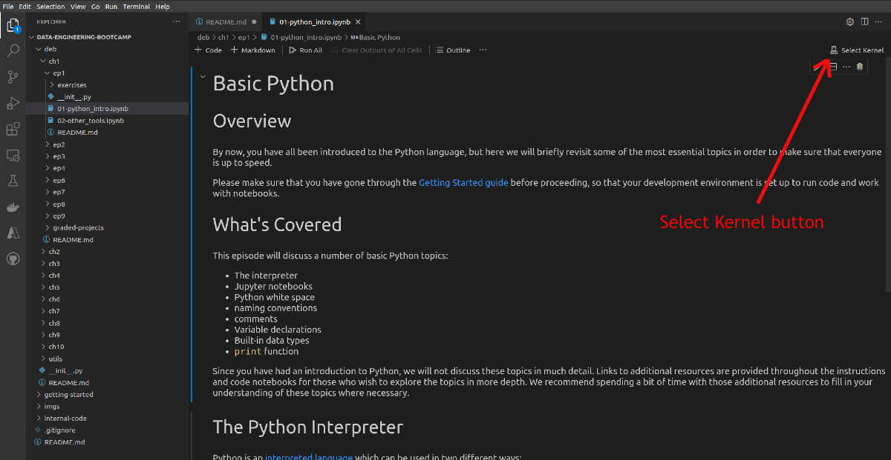
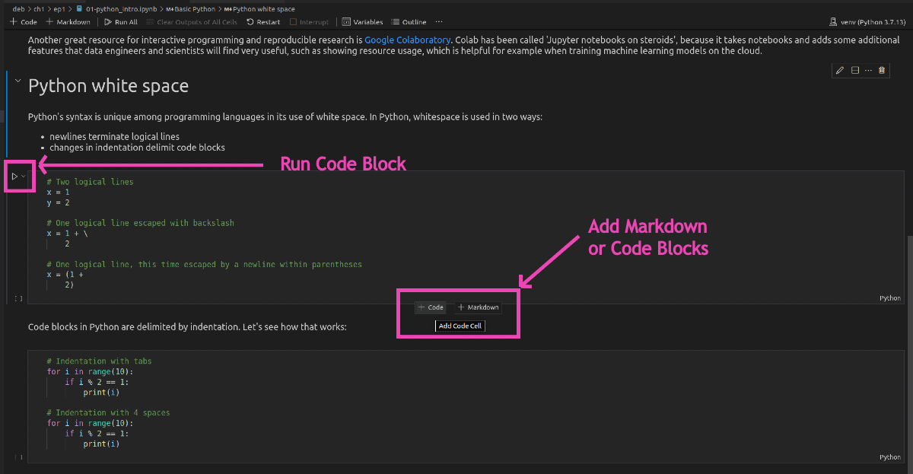
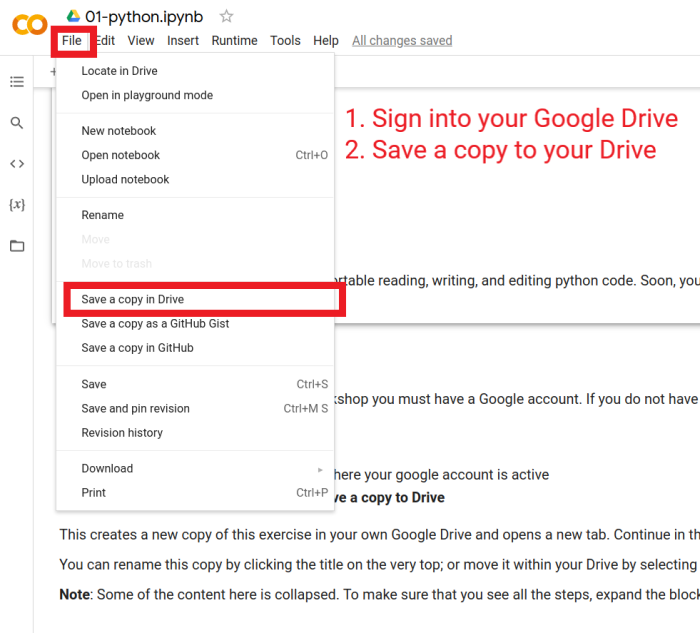
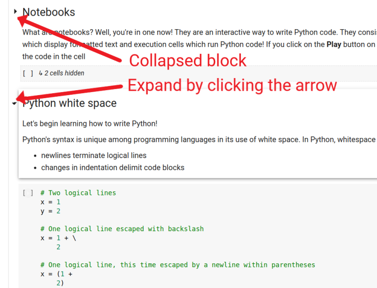
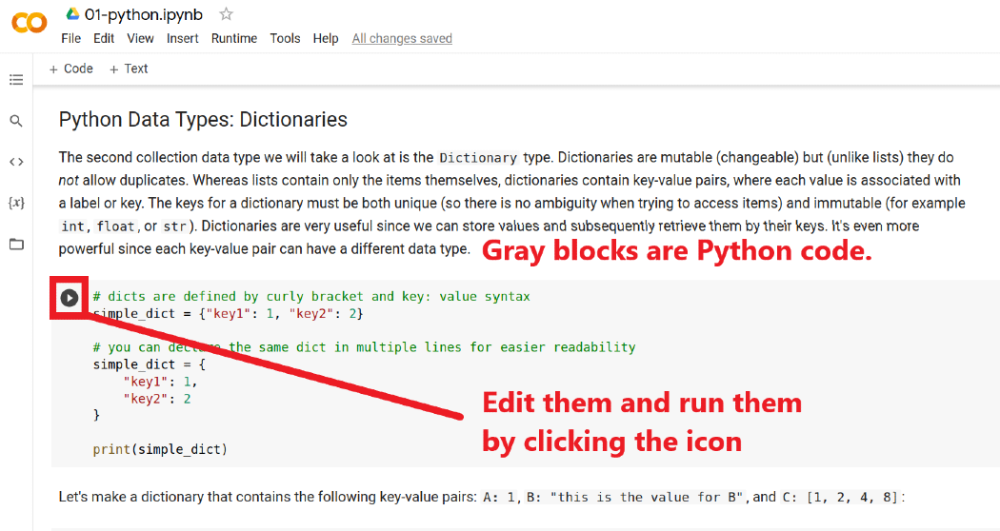

# Getting Started

Before you begin this episode, please make sure you've followed all the steps in the [getting-started guide](https://github.com/datastackacademy/data-engineering-bootcamp/tree/main/getting-started), and that you've read through the [course overview](https://github.com/datastackacademy/data-engineering-bootcamp/blob/main/getting-started/course-overview.md).

Welcome to the **Data Engineering bootcamp**! This is your very first episode. By the end of this course, you will finish another 54 episodes like this one. But you know what they say... The first step is always the hardest. Not completely true... We've done everything to make this first lesson as engaging as possible. So let's get right to it 😉

## Why Python

You might be wondering why Python has become so dominant in the realm of working with data. Python has a number of important and useful features that make it the language of choice for data engineers, scientists, and analysts:

- Code quality - the focus on readability means that Python code is also very readable and maintainable.
- Developer productivity - Python developers are often significantly more productive than with other languages. Python code is typically one-fifth to one-third the size of equivalent Java or C++.
- Code portability - Python is supported by all major operating systems, and porting code between them is usually as simple as just copying code from one machine to another.
- Library support - Python boasts a large collection of built-in functionality (its *standard library*). When more functionality is needed, Python can be extended with user-created libraries, or with a huge collection of third-party support software.
- Component integration - Python is easy to integrate with other application components. It is written in C, can invoke C and C++ libraries, and can be called from C and C++ programs. It also supports integration with many other languages and frameworks.

Python was designed with the goal of having a simple syntax that is less cluttered than other languages, and to be fun to use. The combination of the above features with the focus on an enjoyable developer experience have made Python ubiquitous, particularly for users who are working with large amounts of data.

<br>


# Notebooks

Jupyter Notebooks (or notebooks) is a tool for developing and exploring Python code and data. It's a browser based tool that allows you to develop and run python code interactively. Jupyter provides code blocks, markdown blocks, and graph/visualization capabilities. 

You can execute python code blocks, run bash terminal blocks, explain your thoughts with markdown blocks, and visualize the results in graphs.

This is extremely powerful and makes developing and sharing code very easy. Notebooks (for short) are shared amongst _data engineers_ and _data scientists_ all the time! It fact it's often the data engineer job to review an exploratory (or development) notebook designed by a data scientist and _productionalize_ it. We'll get to this later; but productionalizing a code means making it run on a larger, secure, and reliable production-ready environment; working on real data versus development samples.

<br/>

If you followed the [Getting Started Guide](/getting-started/README.md), you should have installed [Jupyter](jupyter.org) by now. 

```bash
jupyter lab
```

will open Jupyter's browser-based interface that will allow you to explore files and compose notebooks. By now you also should have created a local clone of this repository on your own machine; navigate to the directory where you cloned the repo and you can open notebooks in the Jupyter interface to run them interactively. From time to time during the course we will explore interactive code demonstrations together, and you will need to know how to work with notebooks outside of the pre-rendered view in GitHub.

### Google Colaboratory

Another great resource for interactive programming and reproducible research is [Google Colaboratory](colab.research.google.com); or better known as **Colab**. Colab has been called 'Jupyter notebooks on steroids', because it takes notebooks and adds some additional features that data engineers and scientists will find very useful, such as showing resource usage, which is helpful for example when training machine learning models on the cloud.

## Working on this lesson

You have a couple different ways to work on the (Jupyter) **notebooks** in this lesson:

1. Open them in VS Code 
1. Open them with Google Colab

We recommend using VS Code to keep everything in one place. If you have **not** been able to complete the [getting-started](/getting-started/README.md) section successfully, you can use the Colab notebooks below. This will allow to continue with the today's exercises while you get your environment set up later. 

<br/>

### Working with notebooks in VS Code

You can open any of the `.ipynb` files in this [lesson](.) in VS Code.

In order to run the notebook code blocks, you need to tell VS Code which Python kernel to use. We recommend that you use your local python `venv` (virtualenv) for this lesson. The venv must also have Jupyter notebook installed. 


1. If you haven't done so yet, create a `venv` for this episode and pip install notebooks:

    You can skip this, if you already have a `venv` create. Just make sure to activate it by running `source venv/bin/activate`.

    ```bash
    cd ch1/ep1

    # create a python virtualenv and activate it
    python3.7 -m venv venv
    source venv/bin/activate

    # install requirements.txt including jupyterlab
    pip install -r requirements.txt

    # or alternatively only install jupyterlab
    pip install jupyterlab
    ```

1. Open the [`01-python_intro.ipynb`](./01-python_intro.ipynb) notebook.
1. Open the VS Code command prompt by using the keyboard shortcut `CTRL` + `SHIFT` + P and type: `Notebook: select notebook kernel`.
    
    

    Alternatively, you can click the kernel button in the top right corner of the screen:

    

1. Pick your python venv path from the list (`./workspace/ch1/ep1/venv/bin/python` or `./deb/ch1/ep1/venv/bin/python`).
1. If you python venv path is not on the list, you must refresh your python interpreter and reopen the file:
   1. Close the `.ipynb` file
   1. Open the VS Code command prompt: `CTRL` + `SHIFT` + P and type `python: select interpreter`
   1. Select "+ Enter interpreter path..." and navigate to your venv python path: `./venv/bin/python`
   1. Reopen the `ipynb` file and repeat the instructions above to select notebook kernel


Now you should be able to run code blocks and add markdown or code cells:



<br/>

### Working with notebooks on Google Colab

You can find the Colab notebooks for this lesson under:

- [`01-python_intro.ipynb`](https://colab.research.google.com/drive/1BS2LLjePK5ntIOmPQ6Jvbv6krK9F5TtI)

In order to edit and run the code in Colab you must have a **Google account**. Since these notebooks are **read-only**, you must copy them into your own Google Account to work on them: 

1. **Sign** into your **Google account**
2. **Open** the notebooks URLs above in a new browser tab where your google account is active
3. From the menu above select **File > Save a copy to Drive**



This creates a new copy of this exercise in your own Google Drive and opens a new tab. Continue in the new tab.

You can rename this copy by clicking the title on the very top; or move it within your Drive by selecting File > Move.

**NOTES:**

1. It's possible that some of the content blocks here are collapsed. To make sure that you see all the steps, expand the block by cliking the small arrow next to it.

   

1. The gray blocks are python code cells. You can click and edit them. Some of the exercises below would require you to edit them before you can continue to the next section. Please make sure that you **complete** and **run** each code cell before moving onto to the next one. You can run the code by clicking the _run_ icon to the left of the block when you hover over it.

   

1. It is very important that you run each code cell before moving onto the next. Some of the code cells depend on the values from the previous ones.


<br/>

After all that setup, you're finally ready to get to the fun part: Python. In the `notebooks` folder of this repository, open `01-python_intro.ipynb`. It has instructions, examples, and exercises for you to work through.


