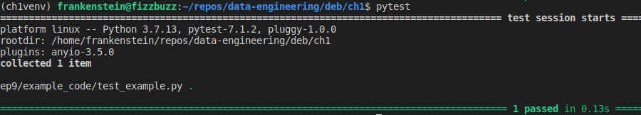
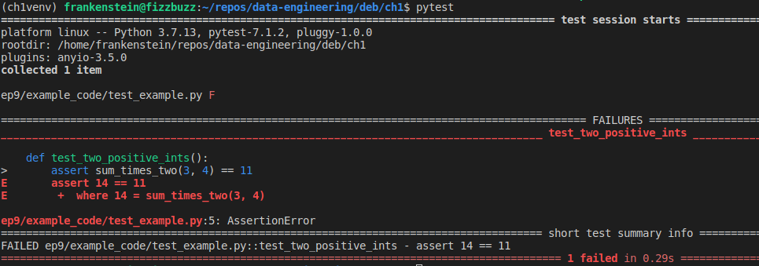

# Unit-tests and More Python Practice

In a previous episode, we looked at tools for debugging in Python. Today, we'll be learning about writing tests to catch bugs for us.

Tests confirm that your code is producing the output you expect it to. For instance, we expect the following function to add two numbers together, and multiply the sum by 2:
```python
def sum_times_two(x, y):
    return(2*(x + y))
```
You could write a few test cases with print statements, then run the file to make sure it does what you expect, but that leaves clutter throughout your code. The other problem with that method is that once your code starts getting more complex, changing something in one part could inadvertently change the outcome of a different part; unless you test each part every time you make a change, you may wind up with bugs that are difficult to track down.
That's where tests come in. Each test has a statement asserting that a certain input to a function produces a certain output. For the example above, we expect that passing in arguments of 3 and 4 will return a result of 14, so we can write
```python
assert sum_times_two(3, 4) == 14
```
...and that's the whole test! The nice part is that all the tests for a file can be run at once, so you don't have to uncomment and re-comment print statements every time you want to make sure the code's working correctly.

There are several popular tools for writing tests in Python, including `unittest`, `nose`, and `pytest`. `unittest` is part of the Python standard library, and requires that you write your tests as methods in a class. `pytest` is somewhat more elegant, and what we'll be working with today. It needs to be imported, so make sure you've installed the `requirements.txt` file from this episode in your virtual environment.

`pytest` works like this:
- Write a function for each test. The name of the function should describe what the test is doing, and _it has to start with `"test_"` in order for `pytest` to recognize it_.
- The body of the test function starts with the `assert` keyword
- What's being asserted is that passing certain arguments to the code you're testing outputs a certain result.

Writing the above check for `sum_times_two()` in a pytest would look like this:

```python
def test_two_positive_ints():
    assert sum_times_two(3, 4) == 14
```

When you run the command `pytest` in the root directory of your project, `pytest` will look for and run all functions that begin with`test_`. If all the tests pass, meaning that all the `assert` statements evaluate to `True`, you'll see an output like this:



<br>

The output tells you how many tests it's running the filepath where the tests are located, and whether they all passes. Notice the tiny green dot after the filepath. A green dot means passing (one dot per test). If the test fails, you'll see an `F` instead, with some details on what failed:



#### Exercises:

- Create a file called `test_example.py`. At the top, copy definition of the example `sum_times_two()` function. Below the function definition:
    - Write a test for passing in a positive and a negative integer
    - Write a test for passing in two floats

The `example_code` folder has some more example functions to work with, and a files of tests for them. Each example function has different types of expected arguments and different cases in which they'd fail. Let's start with the first one:
```python
def tip_calculator(percent: float, bill: float) -> int:
    try:
        percent_as_decimal = percent/100
        tip = percent_as_decimal * bill
        return(round(tip + bill))
    except:
        return(None)
```
`tip_calculator()` already has a `try/except` to catch arguments that won't work with the arithmetic in the code, like strings. So, what do we want to check for? Some suggestions:
- Test that the function returns the expected integers when you pass in two integers
- Test that the function returns the expected integers when you pass in two floats
- Test that the function returns `None` when one of the inputs is a string
- Test that the function raises an error when the wrong number of arguments is passed
>Note: Each test should just test one small thing, not several use cases at once.
These tests have already been written for you in `test_tip_cal.py`; if you run `pytest` in your terminal in the directory of this episode, all the tests should pass. Notice that at the top, the function we're testing is imported from the file where it's written. 

The first three check that `tip_calculator()` passes as expected, given certain arguments. These tests follow the format described above. Take a look at the fourth one,`test_wrong_num_args()` though. It's testing that the function _fails_ as expected. If a user passes in the wrong number of arguments, the function should raise an exception. To test for this, we use `with pytest.raises(Exception) as e:` (notice that `pytest` is imported at the top of the file, so you can access its built-in methods using dot notation).

#### Exercises:
- Write a test for `tip_calculator()` for when one of the arguments is a list.
- Write a test for `tip_calculator()` for when the user passes in more than 2 arguments.
- Run `pytests` to see that all the tests pass.

#### Exercise:
- In `test_say_hi.py`, write tests to test whether `say_hi()`:
    - returns a string greeting the user when they pass in a string.
    - returns `None` when the user doesn't pass in an argument.
    - raises an exception when too many arguments are passed in.
    - can handle arguments that are data types other than strings.

#### Exercise:
- `test_describe_iterable.py` contains an example test. Write another, similar one, passing a list of various data types as an argument. Be careful about formatting here; small differences in string formatting, like newlines and spaces, can cause a test to fail.
- Test for when an argument that isn't an iterable is passed to `describe_iterable()`.

If you think of ways to improve the example functions so that they're better at catching exceptions, feel free to add them in! This is great practice for accounting for edge cases.

### Combining Tests with Parametrization
You've probably noticed that most of the tests for each function are doing small variations on the same thing. This redundancy isn't very Pythonic. It's more elegant to use `pytest`'s built-in `parametrize` method, which takes a list of tuples of arguments. Instead of writing a new test for each variation, you can just write one test that passes in each variation, one at a time.

Revisit `sum_times_two()` from above to see how this works. Writing a bunch of tests that each pass two numbers to `sum_times_two()` could look like this:
```python
def test_two_positive_ints():
    assert sum_times_two(3, 4) == 14

def test_all_zeros():
    assert sum_times_two(0, 0) == 0

def test_two_negative_ints():
    assert sum_times_two(-1, -2) == -6
```
...etc. Rather than typing the same code many times, `parametrize()` allows you to write a list of arguments, which are then passed to the parameters. Written with `parametrize()`,  the tests above would look like this:
```python
@pytest.mark.parametrize("x, y, total", [
    (3, 4, 14),
    (0, 0, 0),
    (-1, -2, -6)
])
```
- The `@` is a Python decorator. We'll get to those later in this course, but don't worry about it now.
- The first argument to `parametrize()` is a single string of comma-separated names for the parameters. They should match the names of the parameters in the function definition, except for the parameter representing the return value, which you can call whatever you want.
- The second argument to `parametrize()` is a list of tuples. The values in each tuple are the arguments that will be passed to the parameters one at a time, as if it were a 'for' loop. The order of the values in each tuple matches the order of the parameters in the first argument to `parametrize()`, just like the positional arguments in the functions we've used up til now.

You can then write a single test that will pass in and test the tuples, one by one:
```python
def test_correct_total(x, y, total):
    assert (sum_times_two(x, y)) == total
```
There's another example of `parametrize()` at the bottom of `test_tip_calc.py`.

#### Exercise:
- Use `parametrize()` to test whether passing the string `"Jarret"` as an argument to `say_hi()` returns `"Hi, Jarret!"`, and that not passing any argument returns `"Hey, what's your name?"`.
 
 #### Exercise:
 - Use `parametrize()` to consolidate the tests you wrote for `describe_iterable()`, `say_hi()`, and `tip_calculator()` that all follow the same pattern (exclude the tests that use `with pytest.raises(Exception)`).

### Conclusion
For any function, there are countless inputs and outputs that could be tested. How do you decide how many tests to write? There aren't hard rules, but it's a good idea to test at least that:
- Each function passes as expected, given the certain arguments.
- Each function can handle common user errors, like passing in the wrong data type or the wrong number of arguments.

The [`pytest-cov` module](https://pytest-cov.readthedocs.io/en/latest/) is useful for showing what percentage of the code the tests cover. "Test coverage" just means how much of the code the tests are actually testing; it's generally good to aim for at least 80% coverage.

Not only does testing alert you when you've inadvertently broken your code and let you find errors before your users do, it also trains you to write code that accounts for user error. By including code like default keyword args and `try/except` blocks, you can assure that your code is most likely to run properly.


#### Further Reading:
- [Pytest docs](https://docs.pytest.org/en/7.1.x/)
- [Real Python article on Pytest](https://realpython.com/pytest-python-testing/)