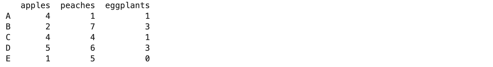
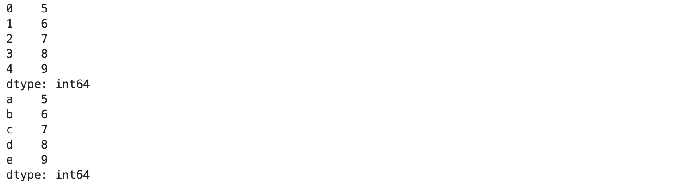

# Chapter 1, Episode 6 - (Introduction to Pandas)

[Pandas](https://pandas.pydata.org/) is a very powerful Python library for working with data. It provides data structures and tools for doing high-performance, practical data analysis in Python. It is one of the fundamental  building blocks of scientific computing in the Python ecosystem (along with NumPy, SciPy...).

Here are some highlights of what Pandas provides:
  * an efficient DataFrame object for manipulating data
  * many tools for reading and writing data between structures and formats (CSV/text, Excel, SQL databases, and more)
  * Flexible reshaping of datasets; aggregation with a `group by` engine; high-performance merging and joining
  * Time series functionality

## History

In 2008, developer Wes McKinney began work on pandas while working at AQR Capital Management, because he needed a tool to perform quantitative analysis on financial data. By the next year, he had convinced AQR management to allow him to make the library open source. In 2012, the first edition of *Python for Data Analysis* was published, drawing more attention to the project. In 2015, pandas became a [NumFOCUS](https://numfocus.org/) sponsored project, which boosted it into the highest realm of research, data, and scientific computing open source projects. Pandas has become an indispensable tool for data scientists, engineers, researchers, and anyone needing to work efficiently with data, and now has millions of users around the world.

## Episode Resources
  The code resources for this episode are all in [Jupyter notebook](https://jupyter.org) format:
  1. [Intro to Pandas](01_intro.ipynb)
  2. [Pandas I/O: Reading and Writing Data](02_readwrite_io.ipynb)
  3. [Selectors](03_selectors.ipynb)

## Intro to Working With Pandas

One of the most important tools that Pandas provides is data types that are optimized for working with data in one or two dimensional formation. For one-dimensional data (similar to a list in Python), Pandas provides the Series data type. And for tabular data, Pandas provides the DataFrame.

### DataFrames

One of the most important, and commonly used, things that Pandas provides is the [**DataFrame**](https://pandas.pydata.org/pandas-docs/stable/user_guide/dsintro.html) type. A DataFrame is a 2-dimensional labeled data structure with columns that can hold different types of data...

#### Creating DataFrames

DataFrames can be created by passing a dictionary containing column names and values. Let's take a look:

```
import pandas as pd

df = pd.DataFrame({'apples': [4, 2, 4, 5, 1],
                   'peaches': [1, 7, 4, 6, 5],
                   'eggplants': [1, 3, 1, 3, 0]})
print(df) 
```
Notice that we pass a dictionary to the DataFrame constructor, with column names as keys and lists as row values. 


Once we have a DataFrame object which contains data, we can access individual columns, rows, or cells using the bracket syntax that is familiar to us from working with Python lists:
```
print("The first row in 'apples':")
df['apples'][0]
df.apples[0]
```

We can also access not only individual values but a range (or 'slice') of them:
```
df['apples'][0:4]
```
As we will see later, this will be quite useful to us in data engineering work; we might, for example, want to extract some rows from the middle of a dataset and process those separately, and slicing allows us to do that easily.

When we create a DataFrame, we can specify an *index*. An index is like an address - it is a unique value, used as a row label, that allows us to easily access individual rows:

```
df = pd.DataFrame({'apples': [4, 2, 4, 5, 1],
                   'peaches': [1, 7, 4, 6, 5],
                   'eggplants': [1, 3, 1, 3, 0]},
                 index=['A', 'B', 'C', 'D', 'E'])
print(df)
```



```
# you can use both index by position or label
# the correct way would be by label
df['apples']['A']
# or by position
df['apples'][0]
```
Both ways of indexing shown above will return the same value, the first value in the 'apples' column (`4`).

The same method of indexing can be used to assign values to a DataFrame:

```
# assign a single value
df['apples']['A'] = 10

# assign and add an entire column
df['oranges'] = 0
df['oranges']['D'] = 2

# add an entire row. you will learn .loc later
df.loc['F'] = {'apples': 3, 'peaches': 0, 'eggplants': 3, 'oranges': 1}

print(df)
```
The first example assigns the value `10` to a single cell. The last example uses .loc to add an entire row. We will discuss .loc in more detail later.

### Series

In addition to DataFrames, Pandas also provides a Series datatype. Think of a Series as one dimensional (a single row, like a Python list), whereas a DataFrame is two-dimensional (rows and columns).

```
type(df['apples'])
```

```
s = pd.Series(range(5,10))
print(s)
s = pd.Series(range(5,10), ['a', 'b', 'c', 'd', 'e'])
print(s)
```


```
d = {"b": 1, "a": 0, "c": 2}
pd.Series(d)
```

```
pd.Series(d, index = ['c', 'd', 'a'])
```

```
d = {"b": 1, "a": 0, "c": 2}
d['a']
```

```
s = pd.Series(range(5,10))
s[2:6]
```

## I/O: Reading and Writing Files

One of the most important uses of Pandas is reading and writing data to and from files. Pandas provides [built-in I/O functions](https://pandas.pydata.org/pandas-docs/stable/user_guide/io.html) for this purpose, making it easy to read and write data and convert between file formats. The following example uses the `read_csv()` function to load airport data from a file.

```
data_dir = '../../../data/input/ch1/'
airports_file = data_dir + 'airports.csv'
airports = pd.read_csv(airports_file, header=0)
print(airports.head())
```

We can also explicitly specify which characters read_csv() should use for separating fields and for line termination:

```
# setting separator and line terminator characters
airports = pd.read_csv(airports_file, header=0, sep=',', lineterminator='\n')

print(airports.head())
# reading only 10 rows and selected columns
airports = pd.read_csv(airports_file, header=0, nrows=10, 
                      usecols=['airport', 'city', 'state'])

print(airports.head())
```

We can use 'dtype' to assign data types to columns. This might be useful, for example, if a column contains integer values and gets read in as an integer type, but we need to perform floating-point calculations on the data later:

```
import numpy as np

# using `dtype` to assign particular column data types
airports = pd.read_csv(airports_file, header=0,
                      dtype={
                          'lat': np.float64,
                          'long': np.float64
                      })

# print
print(airports.head(10))
```

The read_csv function provides other options for reading in data. The `header` option is used to automatically extract column names from a row in the .csv file. The following example tells read_csv() to use the first row (row 0) of the file as the header row (the one containing column names).

```
def pad_iata(value:str):
    while len(value) < 4:
        value = "0" + str(value)
    return value

# using `converters` to pass functions to parse fields
airports = pd.read_csv(airports_file, header=0,
                      converters={
                          'iata': pad_iata,
                          'lat': (lambda v: int(np.round(float(v)))),
                          'lon': (lambda v: int(np.round(float(v)))),
                      })

# print
print(airports.head(10))
```

A very common use of Pandas is to rename or drop columns, or to remove certain rows. Here's how to do that:

```
# rename two columns and create a new DataFrame with the results
updated_airports = airports.rename(columns={'airport': 'airport_full_name',
                        'iata': 'iata_code'})

# drop the lat and lon columns from the new DataFrame in place
updated_airports.drop(columns=['lat', 'lon'], inplace=True)

# remove rows - removing rows 0-3 by their label (index)
updated_airports.drop(labels=[0,1,2], inplace=True)

# Check our handywork
updated_airports.head()
```


```
updated_airports = airports.copy()
updated_airports.reset_index(inplace=True)
print(updated_airports.head())
updated_airports.drop(columns=['index'], inplace=True)
updated_airports.reset_index(inplace=True, drop=True)
print(updated_airports.head())
```

Finally, here's how to use Pandas to convert between file types (in this case, reading from .csv and writing to JSON and parquet formats). See the [full list of IO tools](https://pandas.pydata.org/pandas-docs/stable/user_guide/io.html) for more details.

```
# read csv
airports = pd.read_csv(airports_file, header=0)

# write json row format
airports.to_json(data_dir + 'airports.json', orient='records', lines=True)
# write compressed parquet format
airports.to_parquet(data_dir + 'airports.parquet', engine='pyarrow', 
                   compression='gzip', index=False)

print('done.')
```

## Selectors

The final topic in our discussion of basic Pandas is *selectors*. Pandas provides three types of multi-access indexing. In addition to the bracket syntax we have already learned, we can also use .loc and .iloc. 

```
# set data directory and input csv
data_dir = '../../../data/input/ch1/'
airports_file = data_dir + 'airports.csv'

# read data fom csv
airports = pd.read_csv(airports_file, header=0)

# select single row by index
airports.loc[0]

# select multiple rows with slices
airports.loc[[0, 5, 7, 10]]
airports.loc[0:3]

# select multiple rows and columns by index
airports.loc[0:3,['airport', 'city', 'state']]
```

.loc is primarily label-based, but can also be used with a boolean array. .iloc is primarily integer-position based, but can also be used with a boolean array.

For more details, see the docs on [Indexing and Selecting Data](https://pandas.pydata.org/pandas-docs/stable/user_guide/indexing.html). 

Here are some more examples using .loc and .iloc.

```
# select first row
airports.iloc[0]

# select multiple rows with slices
airports.iloc[[0, 5, 7, 10]]
airports.iloc[0:3]

# select multiple rows and columns by position
airports.iloc[0:3,[0, 2, 1]]
```

And here is an example which uses both .loc and .iloc in the same statement. This is very useful if we need to select a subset of rows and columns from the entire DataFrame.

```
# mixing loc and iloc
# select rows 5-10 and few columns
airports.iloc[5:10].loc[:, ['airport', 'city', 'state']]
```

### Conditional Selections

In addition to selecting rows and columns based on the index values, we can also select based on the actual data values in a specific column. This type of selection lets us filter out only the values we need from the data:

```
# select delta airline airports
airports.loc[airports.state == 'NY']
# same as above
airports.loc[airports['state'] == 'NY']

# airports where city is not null
airports.loc[airports.city.notna()]
# or where city is null
airports.loc[airports.city.isna()]

# select airports in New York city, NY
airports.loc[(airports.state == 'NY') & (airports.city == 'New York')]

# apply multiple conditions::
# select New York City or Alaska airports
airports.loc[(airports.city == 'New York') | (airports.state == 'AK')]
```

The query() function lets us use a SQL-style syntax to achieve the same thing:

```
# select airports from New York city, NY
airports.query("(city == 'New York') & (state == 'NY')")
```

```
# select airports from PDX
ny_airports = airports.loc[airports.state == 'NY']
# find long distance airports
nyc_airports = ny_airports.query("city == 'New York'")
nyc_airports
```

### Further Reading
* [Pandas Documentation (ReadTheDocs)](https://aaltoscicomp.github.io/python-for-scicomp/pandas/)
* [Intro to Data Structures](https://pandas.pydata.org/pandas-docs/stable/user_guide/dsintro.html)
* [Pandas Basic Operations](https://pandas.pydata.org/pandas-docs/stable/user_guide/basics.html)
* [Pandas Indexing](https://pandas.pydata.org/pandas-docs/stable/user_guide/indexing.html)