# Ch. 1, Ep. 7: Exploring Data with Pandas

## Episode Resources
- [Exploring Data](01_exploring_data.ipynb) (notebook)

<br>

Now that we have introduced Pandas, we will look in more detail at how to perform exploratory data analysis. When we first encounter a new dataset, and before we begin to do any data manipulation, it is essential to explore the data, in order to familiarize ourself with the structure, and so that we can get an idea of what issues we will confront in dealing with the dataset.

## Profiling Data

When we first encounter a new dataset, it is important to quickly get an idea of what it contains. In order to work with the data, we need to know its structure (column names and data types), typical values, whether data is missing, and other key features. Pandas provides a number of useful functions for profiling data.

As always when using Pandas, we need to import the library before we use it:

```python
import pandas as pd
```

NOTE: the above syntax ('import pandas as pd') is known as *aliasing*. It is not necessary to use an alias, but our code will assume that we have done so. Using 'pd' as an alias for pandas is common practice, and many code examples you will see, in this class and elsewhere, assume that you have imported pandas using 'pd' as an alias.

Now let's take a look at some of the Pandas profiling functions. Theses are the common and useful functions that will help you quickly get an idea of what your data looks like.


<br>

### head() and tail()

A great place to start when previewing data is to use the [`head()`](https://pandas.pydata.org/docs/reference/api/pandas.DataFrame.head.html) function, which shows us the column names and data values for the first *n* rows (default n=5):

```python
print routes.head()
```

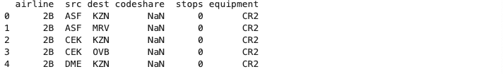

If you want to see more rows, you can specify that when calling head():

```python
print routes.head(10)
```

A close counterpart to head() is [`tail()`](https://pandas.pydata.org/docs/reference/api/pandas.DataFrame.tail.html), which is almost identical except that it returns the last *n* rows:

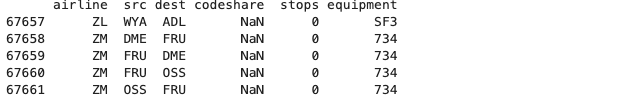

Notice that the row numbers (leftmost values) are now different, which confirms that tail() is returning the last rows in the dataset.


<br>

### count()

Another useful preview function is [`count()`](https://pandas.pydata.org/docs/reference/api/pandas.DataFrame.count.html), which gives us the count of non-empty values in each column. This is a quick way to identify which columns have missing data. Notice that the 'codeshare' column  is sparsely populated (has a lot of missing values) - less than a quarter of the records contain non-empty values for this column. This is a good thing to know up front, because as data engineers, we will often need to deal with this sort of situation where a lot of values are missing. We'll say more about that later; for now, just know that count() helps us to quickly identify columns with missing values:

```python
routes.count()
```

<br>

### info()

Another function that gives us a concise description of a DataFrame is [`info()`](https://pandas.pydata.org/docs/reference/api/pandas.DataFrame.info.html). This function lets us quickly learn the shape of our data. Here's an example:

```python
print(routes.info())
```

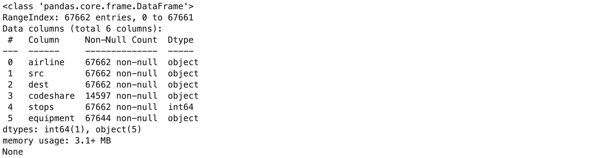

<br>

### describe()

Another profiling function built into Pandas is [`describe()`](https://pandas.pydata.org/docs/reference/api/pandas.DataFrame.describe.html). This function gives us a statistical breakdown of our data, with minimum, maximum, mean, and standard deviation for numeric data, or (in the case of object data like strings or timestamps), count, most common value, frequency of that value, and a few other things depending on the exact data types. 

```python
print(routes.describe())
```

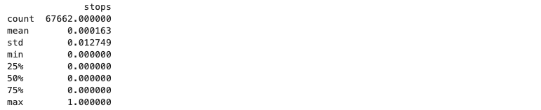


<br>

### shape

The last built-in profiling tool that we will look at is [`shape`](https://pandas.pydata.org/docs/reference/api/pandas.DataFrame.shape.html), which is a property of every DataFrame. This function returns a tuple containing the dimensionality (number of rows and columns) in the DataFrame. Because it is a DataFrame property (and not a method), we do not use parentheses when calling it.

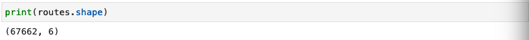


<br>

### Dropping Duplicate Rows

Sometimes when working with data, we will want to remove any duplicate rows. Pandas makes this easy with [`drop_duplicates()`](https://pandas.pydata.org/docs/reference/api/pandas.DataFrame.drop_duplicates.html):

```python
print(routes.drop_duplicates().shape)
print(routes.drop_duplicates(ignore_index=True).shape)
print(routes.drop_duplicates(ignore_index=True, subset=['src', 'dest']).shape)
```

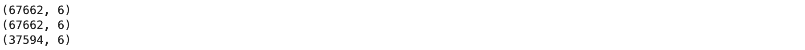

When we first apply drop_duplicates, the number of rows in the recordset doesn't change (see the first two lines of output). This tells us that, in this case, there are no duplicate rows. It is important to realize that, by default, drop_duplicates() checks for duplicated values across all columns in the DataFrame. But what if we want to check for duplicates in only a subset of columns? Pandas makes that easy as well. The last line of code above (where drop_duplicates() is called with the 'subset' option) demonstrates that we can pass a list of columns as a subset to check for duplication. When we apply this less restrictive test for duplicate values, we can see (from the last line of output) that drop_duplicates() is removing many rows from the DataFrame.

<br>

## Profiling with pandas-profiling

The profiling functions we have discussed up to this point are all built into Pandas. Additional profiling capability is provided by the `pandas-profiling` package. To use that package, we first need to install it. [Follow the installation guide here](https://pandas-profiling.github.io/pandas-profiling/docs/master/rtd/pages/installation.html).

Once the package is installed, we can import it and create a ProfileReport:

```python
from pandas_profiling import ProfileReport

profile = ProfileReport(routes, title="Pandas Profiling Report")
profile.to_notebook_iframe()
```

The ProfileReport is generated in a browser-friendly format:

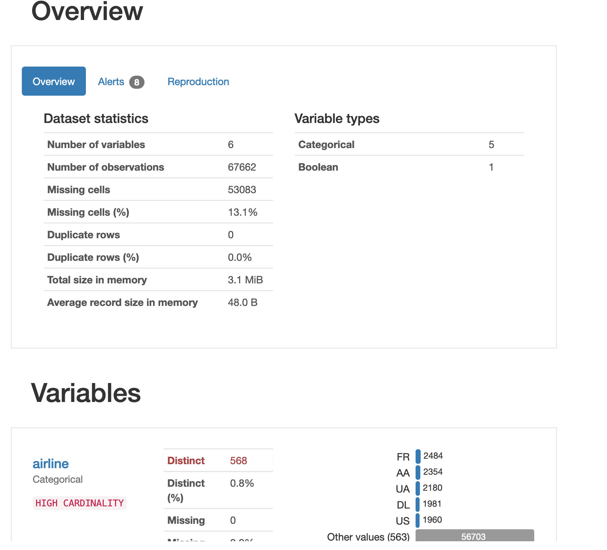

Particularly with larger, more complex datasets, these profiling reports can be invaluable, because we can get a lot of information about our data in one place, without having to use many separate functions.

<br>

## Aggregation functions

Python provides a number of aggregating functions, which calculate things like the mean of all values in a column. Let's use what we just learned about profiling to inspect a new dataset, and try out a few of those aggregating functions.

First, let's load the data from .csv and use `head()` and `info()` to inspect it.

```python
fruit_file = data_dir + 'fruits.csv'
fruits = pd.read_csv(fruit_file, names=['fruit', 'day', 'count'])
fruits.head()
fruits.info()
```

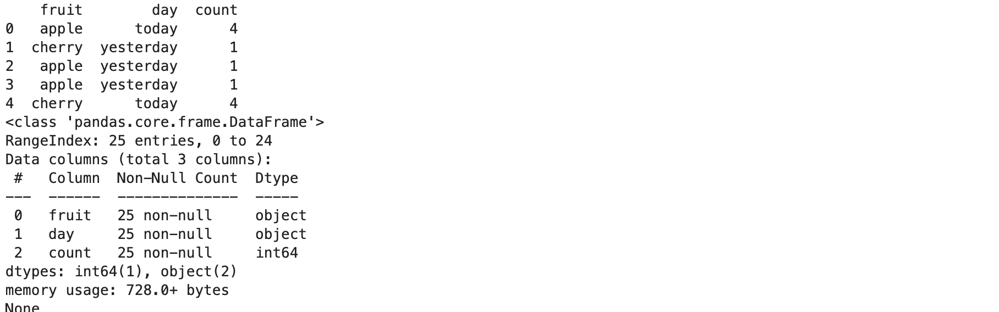

Using head() and info(), we now have an overview of the data - column names, data types, value counts, and more. Now that the data is loaded, we can use aggregation functions to calculate things like the mean value. Here's a sample:

```python
print(fruits[['count']].sum())
apple_count = fruits[fruits.fruit == 'apple'][['count']]
print(apple_count)
print(apple_count.sum())
print(apple_count.mean())
print(apple_count.count())
```


For a full list of available aggregation functions, see [13 Aggregating Functions in Pandas](https://cmdlinetips.com/2019/10/pandas-groupby-13-functions-to-aggregate/).

These aggregation functions are useful on their own, but they will become especially useful once we introduce GROUP BY in the next episode. 

<br>

## Sorting data

When we are previewing data, and also when we are applying transformations, we will often need to sort the data in a particular order. The first tool Pandas provides for this purpose is the [`sort_values()`](https://pandas.pydata.org/docs/reference/api/pandas.DataFrame.sort_values.html) function. 

```python
print(fruits.sort_values(['count']))
print(fruits.sort_values(['fruit']))
print(fruits.sort_values(['fruit', 'count']))

```

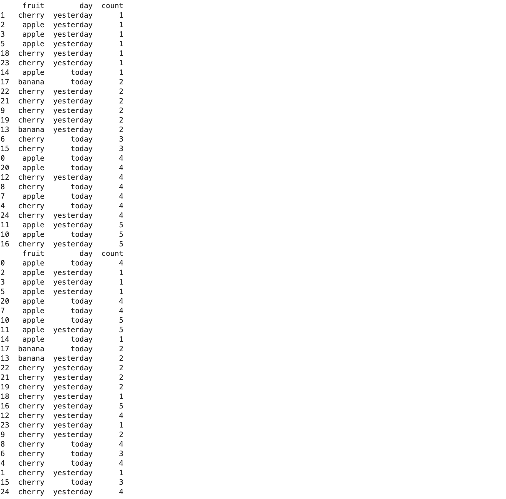

If we need to re-sort by the row index (which is the default sorting behavior), or by the column labels, we can use [`sort_index()`](https://pandas.pydata.org/docs/reference/api/pandas.DataFrame.sort_index.html):

```python
# sort on the row index
print(fruits.sort_index(axis = 0))

# sort on the column labels
print(fruits.sort_index(axis = 1))
```

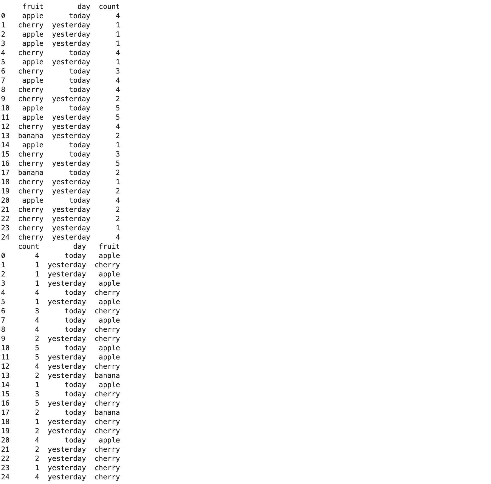

<br>

### Changing Sort Order

There is one more feature of `sort_values()` that will come in very handy as we begin to work with more data - the ability to sort in a particular direction. To do this, use the 'ascending' parameter (which accepts a boolean value, either True or False) when calling `sort_values()`:

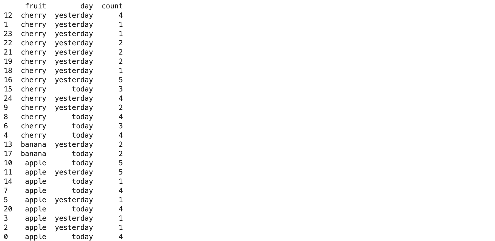

Notice that this time we use a slightly different syntax in calling `sort_values()`, to allow us to pass multiple parameters.

<br><br>
### Further Reading
* Pandas function documentation
    * [head()](https://pandas.pydata.org/docs/reference/api/pandas.DataFrame.head.html)
    * [tail()](https://pandas.pydata.org/docs/reference/api/pandas.DataFrame.tail.html)
    * [compare()](https://pandas.pydata.org/docs/reference/api/pandas.DataFrame.compare.html)
    * [describe()](https://pandas.pydata.org/docs/reference/api/pandas.DataFrame.describe.html)
    * [info()](https://pandas.pydata.org/docs/reference/api/pandas.DataFrame.info.html)
    * [sort_values()](https://pandas.pydata.org/docs/reference/api/pandas.DataFrame.sort_values.html)
    * [sort_index()](https://pandas.pydata.org/docs/reference/api/pandas.DataFrame.sort_index.html)
* [pandas-profiling docs](https://pandas-profiling.github.io/pandas-profiling/docs/master/index.html#pandas_profiling)
* [13 Aggregating Functions in Pandas](https://cmdlinetips.com/2019/10/pandas-groupby-13-functions-to-aggregate/)