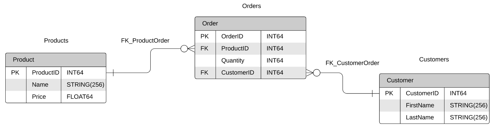
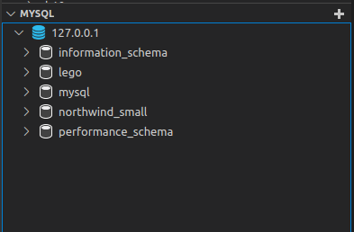

# What is a database?

In most basic terms, a database is a collection of information. This is necessarily a very generalized term; there are many different ways someone might want to collect and store information. The commonality of databases is they are stored on a computer and controlled by a **Database Management System** or **DBMS**. Let's take a quick look at the main two types of databases and the DBMSs associated with each.


# Types of Databases
The umbrella of 'databases' covers a number of different ways to collect and organize data. We will start with the type that we will be using the most in this course.

## Relational
A [**relational database**](https://en.wikipedia.org/wiki/Relational_database) is a database that implements the [relational data model](https://en.wikipedia.org/wiki/Relational_model). This means that a relational database stores its information in tables which themselves are collections of **columns** and **rows**. The rows represent individual records and the columns are the different properties we are storing for that record. Each row also has a unique key or id which is what allows relationships between records to be formed. For example, an inventory system may have one table for orders and another for customers. The information for each order _includes_ the customer making that order but instead of having to copy all the information about that customer, the orders simply need to store the customer's unique key. There is a clear relation between customer and order and the customer key linking the two provides the tangible form of this relationship in our database.

Relational databases are also structured data and follow a relational model. What this practically means is that the structure of the data they store is well defined at the table level and the relations (linking key) between those tables is defined as well. The structure also specifies _exactly_ what our records will contain. While we can allow some flexibility for missing or null values, every record contains the information specified by the columns and *nothing else*. While this may seem inflexible, the upside is that our data is very reliable and we can perform analysis across records with a great deal of confidence. 

As structured data, most relational databases support [Structured Query Language or **SQL**](https://en.wikipedia.org/wiki/SQL). This language allows us a powerful and flexible way to interact with our database. It allows querying of existing data, data manipulation, updating, and deletion as well as table creation and deletion. This language has a number of different implementations that all follow the core concepts but very slightly in the details (as we will see later).

### Key Relationships
In relational databases, relationships between tables are defined by *keys*. There are two types of keys:
- Primary key: a column in a table whose values uniquely identify a row in the table. The uniqueness of the primary key ensures that we can consistently modify one, and only one, row in a table.
- Foreign key: a column in a table whose values correspond to the values of the primary key in another table. Foreign keys establish logical relationships between the data in different tables.

This diagram illustrates the relationship between primary and foreign keys. In the Products table, for example `ProductID` is a primary key, whereas in the Orders table, `ProductID` is a foreign key. This key relationship links the tables together, and will be very important when we begin to discuss `JOIN`s in Pandas and SQL.


Relational database systems use *constraints* to enforce the integrity of data. The following are some examples of constraints:
- the primary key value cannot be NULL
- duplicate entries are not allowed
- in our customer/order example, an order cannot be added to without a corresponding customer

All modern database systems do much of the work of enforcing constraints, but the ultimate responsibility for ensuring the integrity of your data model is yours, as a data engineer. A database platform like MySQL or BigQuery might not allow you to create duplicate records, for example, but you still need to take steps in your code to handle such eventualities. We will look in more detail at this later.

The most common DBMS for relational databases is **MySQL** which is an open source DBMS based on SQL. This means that the entire database is maintained following SQL syntax. 

In this course, we will be [using **MariaDB**](https://mariadb.org/) as our local relational database. It was created by the same folks who made MySQL.

Another common implementation of SQL is [**PostgresSQL**](https://www.postgresql.org/about/).

As big data began to rise, it was necessary to create scalable databases based on the same distributed principles as [HDFS](https://hadoop.apache.org/docs/stable/hadoop-project-dist/hadoop-hdfs/HdfsDesign.html). As a complement to the HDFS Hadoop, Apache created [Hive](https://hive.apache.org/). Hive is an implementation of SQL that uses a distributed storage model that scales to big data. But because it is still build on SQL, it can be interacted with in the language as the non-big data bases.

Following the rise of big data, cloud computing because a major use case for companies. As such, SQL needed to adapt to work in the cloud. The example of this we will use in this course is [Google's BigQuery](https://cloud.google.com/bigquery/docs/introduction). BigQuery is still based on SQL but now is cloud-based, serverless, *and* distributed. This means we can use SQL syntax to interact with our persistent database from anywhere in the world.


## Non-relational or NoSQL
Not all data falls neatly into a structured relationship however. The rise of web-apps and JSON have created very rich and extendible data sources. JSON does not require a pre-defined structure and because of this flexibility, the output of applications using JSON isn't always going to conform to a relational database's data model. While you can jump through some hoops to store this type of data in an SQL system, there are non-structured databases designed specifically to handle these data sources. As non-structured data, these are often referred to as **NoSQL** databases. These will not be the focus of this course but it is important to know what they are and how they are used.

There are multiple types of NoSQL implementations but MongoDB has provided a great overview of them [in this handy guide.](https://www.mongodb.com/nosql-explained)

[MongoDB](https://docs.mongodb.com/) is also one of the most common DBMS for NoSQL. They store data in a [style that closely models JSON.](https://docs.mongodb.com/guides/server/introduction/) which is the **document database** mentioned in their NoSQL guide.

Just as Hive extended SQL to distributed file systems, [Apache HBase](https://hbase.apache.org/) is a distributed implementation of NoSQL. This provides platform that can support big data while accessing it through the same interface as NoSQL. 

All clouds have HBase implementations and most application use this heavily (as you can guess from the introduction to NoSQL). [BigTable is the Google Cloud implementation of HBase](https://cloud.google.com/bigtable/docs/overview). We won't be using this until much later in the course but it is good to be aware of now.


# Docker: Why are we using it?

Docker is a **Container** service that allows us to run services locally without building them from scratch ourselves. Docker is so important to data engineers that the entirety of [Chapter 5](../../ch5/ep1/README.md) is dedicated to learning the ins and outs of Docker. But we want to start using it now because it allows us to create a local database without manually configuring *everything*. This will allow us to incrementally learn the parts of a real database without having to spend a whole week explaining concepts before even touching a database. The first step to using Docker is installation. 

## Install Docker
To install Docker, simply follow [the guide for your OS.](https://docs.docker.com/get-docker/) This will install Docker Desktop which provides a UI but in this course will will primarily use [Docker directly via their CLI.](https://docs.docker.com/engine/reference/commandline/cli/)
> Note: for Linux users, you select the guide for installing on your distribution from the side bar. 
## Commands Cheat Sheet
While we don't need to worry about specific Docker commands until Chapter 5, [Docker has provided a handy cheatsheet of commands](https://dockerlabs.collabnix.com/docker/cheatsheet/). These are what is used within the start and stop scripts


## Start our MariaDB container
All episodes in this chapter come with both a `start_db.sh` and `stop_db.sh` scripts. These start a local MariaDB container and stop it when we no longer need to use it. The following values for our database are set in the `start_db.sh` script (don't worry about fully understanding the Docker command, we will get to that in Chapter 5).
- host: 127.0.0.1
- user: root
- password: mysql
- port: 3306

To get started, simply run:

```bash
./start_sb.sh
```


# Database Interfaces

With our Docker MariaDB up and running, we can learn two different interfaces for interacting with out data: directly through the command line or via a VSCode extension.

## MariaDB command line
MariaDB has a directly command line interface. In order to access this, we can run the `connect_db.sh` script which run the following command:

```bash
docker exec -it mariadb mysql -u root -pmysql
```

Once again, we will leave the Docker details alone for now but what this script does is open an interactive SQL interface on our database container.
If we run `connect_db.sh`, we will see the following output and then the prompt `MariaDB [(none)]>`:

```bash
./connect_db.sh 
Welcome to the MariaDB monitor.  Commands end with ; or \g.
Your MariaDB connection id is 80
Server version: 10.5.10-MariaDB-1:10.5.10+maria~focal mariadb.org binary distribution

Copyright (c) 2000, 2018, Oracle, MariaDB Corporation Ab and others.

Type 'help;' or '\h' for help. Type '\c' to clear the current input statement.

MariaDB [(none)]> 
```

As prompted, we can use the `\h` command to see MariaDB's help function:

```bash
MariaDB [(none)]> \h

General information about MariaDB can be found at
http://mariadb.org

List of all client commands:
Note that all text commands must be first on line and end with ';'
?         (\?) Synonym for `help'.
clear     (\c) Clear the current input statement.
connect   (\r) Reconnect to the server. Optional arguments are db and host.
delimiter (\d) Set statement delimiter.
edit      (\e) Edit command with $EDITOR.
ego       (\G) Send command to MariaDB server, display result vertically.
exit      (\q) Exit mysql. Same as quit.
go        (\g) Send command to MariaDB server.
help      (\h) Display this help.
nopager   (\n) Disable pager, print to stdout.
notee     (\t) Don't write into outfile.
pager     (\P) Set PAGER [to_pager]. Print the query results via PAGER.
print     (\p) Print current command.
prompt    (\R) Change your mysql prompt.
quit      (\q) Quit mysql.
rehash    (\#) Rebuild completion hash.
source    (\.) Execute an SQL script file. Takes a file name as an argument.
status    (\s) Get status information from the server.
system    (\!) Execute a system shell command.
tee       (\T) Set outfile [to_outfile]. Append everything into given outfile.
use       (\u) Use another database. Takes database name as argument.
charset   (\C) Switch to another charset. Might be needed for processing binlog with multi-byte charsets.
warnings  (\W) Show warnings after every statement.
nowarning (\w) Don't show warnings after every statement.

For server side help, type 'help contents'
```

This is a command line interface where we can directly write SQL. We haven't learned any yet but try entering `SHOW databases;` to list the available databases:

```bash
MariaDB [(none)]> SHOW databases;
+--------------------+
| Database           |
+--------------------+
| information_schema |
| lego               |
| mysql              |
| northwind_small    |
| performance_schema |
+--------------------+
5 rows in set (0.004 sec)
```

As we will learn below, we can connect to a specify database with the command `use <database name>`. Running the following sets our working database as `lego`:


```bash
MariaDB [(none)]> use lego;
Reading table information for completion of table and column names
You can turn off this feature to get a quicker startup with -A

Database changed
MariaDB [lego]> 
```

*Any* of the SQL scripts we will be learning and writing below can be run by connecting to our database and entering the query into our command line. For now, we will exit the MariaDB CLI with `\q`, the command to *quit*:

```bash
MariaDB [lego]> \q
Bye
```


## Installing and using VSCode SQL extension
Another very useful way to run SQL code is using the
[VSCode MySQL Extension](https://marketplace.visualstudio.com/items?itemName=formulahendry.vscode-mysql). We already have VSCode installed from our [getting started guide](../../../getting-started/) so install the extension using the side bar *Extensions* tab and searching for MySQL. The top result by Jun Han is the version we want.

You can install the MySQL extension directory from VS Code. Open VS Code and press **CTRL+P** then type `ext install formulahendry.vscode-mysql` and press ENTER.

With our database up and running, we can follow their guide to connect the extension to our database; simply hover over the *MySQL* in the sidebar and select the **+** to create a new connection. Then enter the following values into the prompts (they match those set in the `start_db.sh` script):
- host: 127.0.0.1
- user: root
- password: mysql
- port: 3306
- and leave authentication blank

This will create a database connection listed in the sidebar!



If you want to run a query on a specific database, you can right click it and select *New Query* which opens an empty SQL file to run your query. Once you've written a query, you can right click and select *Run MySQL Query* to run the whole file *or* select the portion of the file you want run before right clicking. In this case, only the selected text will be run as a query. You can also use shortcut **CTRL+ALT+E** to run selected queries. But what queries are we going to run? Let's get started with some basics. 

# Basic Query
We will walk through the introductory queries contained in `basic_query.sql` together. We note that in an SQL file, comment lines are started with `--`. 

## Show database content
One of the first things we will want to do is learn how to show what we have in our MariaDB instance. As you can see from the sidebar extensions, there are multiple databases in the Docker container we started. To see this in SQL, we use the `show` command. Let's list the databases available to us:

```sql
show databases;
```
>Note: SQL queries need to terminate in a `;`. That is how SQL knows when the query ends. This allows us to put line breaks in our queries; SQL only stop to execute ones the `;` is reached.

Once we know what databases we have, let's choose one as our working database using the `use` command. This tells our SQL to run all queries on the specified database:

```sql
-- change the current working database
use lego;
```

>Note: right clicking a database and selecting *New Query* in the VSCode extension also sets that database as the working database.

With a database selected, we can move on to showing what *is in* that database. Once again we use `show`; but this time we want to know the list of tables it contains:

```sql
-- display all tables in the current database
show tables;
```

Show is very useful for seeing what we have in our database but if we want to actually view our data, we will be using the most important SQL command, [`SELECT`](https://www.w3schools.com/sql/sql_select.asp)

## Using `SELECT`

The most basic `SELECT` queries have two parts:
- The word `SELECT` followed by *what* we're selecting (usually column names). There is one special character for `SELECT`, the wildcard `*` which simply means select *everything*.
- The word `FROM` followed by where the data is coming from which is the list of table names we're _selecting_ from. In the most basic case that we're covering here, this will be our a single table name (_colors_). 
>Note: SQL Keywords like `SELECT` and `FROM` are **case-insensitive**, you can write them as `select`, `SELECT`, or even `sELecT` and they'll all run the same. *However* the names of things within our database (table names, column names, etc) **are case sensitive** and must be written correctly. It is best practice to write the SQL keywords in uppercase for clarity.

Now that we know the two pieces of a `SELECT` query, let's view all the column in the `colors` table:

```sql
-- show all the rows in colors table
SELECT * FROM colors;
```

This gives us *all* the rows in a table. While this is useful if we're using the data for analysis, it's a bit much if we just want to take a peek at our data. Luckily, we can add the SQL keyword `LIMIT` to the end of our query followed by the number of rows to return. This is great for allowing us to see what our query may return without accidentally printing thousands of rows:

```sql
-- limit the number of rows displayed
SELECT * FROM colors LIMIT 10;
```

We can also see this in action with our `sets` table:

```sql
-- repeat the same to see the list of our lego sets
SELECT * FROM sets;
SELECT * FROM sets LIMIT 20;
```

Now that we know how to `LIMIT` the number of rows we return, let's return to `SELECT` to show you how to limit number of columns displayed. We've been using the wildcard `*` to select all the columns but we can also specify the columns we want to see. To do this, we provide a comma separated list of the column names. Our `SELECT` query will then return only those columns `FROM` the table we specify *in the order we list the columns*. For example, these are all ways to grab specify subsets of columns from our tables. 

```sql
-- to select only a few columns, list them after your SELECT
SELECT name, year FROM sets LIMIT 20;

-- note the columns appear in the order specified. Compare this query output to the one above
SELECT year, name, set_num FROM sets LIMIT 20;

SELECT id, name, rgb FROM colors;
```

## Ordering query 
If we want to explore our data, it is often useful to be able to sort the returned values from our query. SQL does this with the [`ORDER BY` statement.](https://www.w3schools.com/sql/sql_orderby.asp)  We simply add `ORDER BY column` following the `FROM` statement and SQL knows what to use to sort our data. SQL can order any text or numerical column and by default returns values sorted in ascending order (from smallest to largest). For example, if we want to return the rows of our `color` data, sorted by name:

```sql
-- return colors sorted by name alphabetically
SELECT * FROM colors ORDER BY name;
```

We note that for strings, the `ORDER BY` alphabetizes from A to Z. If we want to instead sort in descending order (from large to small or Z to A), we can add the keyword `DESC` after the column:

```sql
-- return colors sorted by name alphabetically in descending oder (reversed)
SELECT * FROM colors ORDER BY name DESC;
```
>Note: we can also add `ASC` to make the ascending sort explicit.

We can also combine `ORDER BY` with `LIMIT`. The ordering is applied *first* then the number of rows specified by our `LIMIT` are returned:

```sql
-- this is useful with LIMIT
SELECT * FROM colors ORDER BY name DESC LIMIT 10;
```

`ORDER BY` also supports multiple columns. We simply supply a comma separated list as we did in the `SELECT` statement. The rows are sorted by the first column we specify, *then* within that ordering, they are sorted by the second column and so forth. For example, if we want to sort our `sets` by number of parts and within the number of parts, sort by name, we can do the following:

```sql
-- sort sets by number of parts and then by name
SELECT * FROM sets ORDER BY num_parts, name;
```


## Filtering rows

We know how to specify columns, limit the number of rows in our query, but what if we want to filter only specific rows we are looking for within a table? To do this, we use the [SQL `WHERE` statement](https://www.w3schools.com/sql/sql_where.asp). The `WHERE` follows the `FROM` statement and has the following format `WHERE condition` with `condition` being a conditional statement that can be evaluated as **True** or **False** for each row. The most basic condition is `=`. To find our sets `WHERE` the `year` is equal to `1990`, we cn use the query:

```sql
SELECT * FROM sets WHERE year = 1990;
```

We can also use `=` with text fields, we simply have to contain the value we're comparing in single quotes:

```sql
-- selecting strings (text) must be wrapped in single quotes (')
SELECT * FROM sets WHERE name = 'Glory Glider';

-- try other values: Helicopter, Wave Racer
SELECT * FROM sets WHERE name = 'Helicopter';
SELECT * FROM sets WHERE name = 'Wave Racer';
```

The full list of operators are:
- `=`  :(equal), 
- `<>` : not equal to
- `<`  : less then
- `<=` : less then or equal to
- `>`  : greater than
- `>=` : greater than or equal to


```sql
SELECT * FROM sets WHERE year > 1990;
```

### Combining conditions
You can also combine conditions using `AND`, `OR`, and `NOT` to make more complex conditions. Simply use these keywords and `()` to group the true/false conditions together. Let's play around with our operators and combining conditions:

```sql
-- show all sets in 1990 and with more than 200 parts
SELECT * FROM sets WHERE year = 1990 AND num_parts > 200;

-- show all sets in 1990 and with more than 200 (or equal to) parts but less than 300 parts
SELECT * FROM sets WHERE year = 1990 AND num_parts >= 200 AND num_parts < 300;

-- you can use parenthesis to logically group conditions
-- this is the same statement as before
SELECT * FROM sets WHERE year = 1990 AND (num_parts >= 200 AND num_parts < 300);

-- try more examples
-- list lego sets over 2,000 parts and in 2015 or 2016
SELECT * FROM sets WHERE (year = 2016 OR year = 2015) AND num_parts > 2000;
SELECT * FROM sets WHERE (year = 2016 OR year = 2015) AND (num_parts > 2000 AND num_parts < 3000);

-- you can use NOT to negate a group or condition
-- this will show all sets in 1990 but outside of 200-300 parts (so with 1-199 and above 300 parts)
SELECT * FROM sets WHERE year = 1990 AND NOT (num_parts >= 200 AND num_parts < 300);

SELECT * FROM sets WHERE num_parts >= 2000 AND num_parts < 3000;

SELECT * FROM sets WHERE year = 2016 AND num_parts >= 2000 AND num_parts < 3000;

-- lego sets with over 3,000 parts and not in 2016
SELECT * FROM sets WHERE year <> 2016 AND num_parts > 3000;
```

if we want to look for values between two values, we could combine a `>=` and `<=` using `AND` *or* we could use a `BETWEEN` statement. This follows the column name and takes two values in the following format:

```sql
-- there's also BETWEEN
-- select sets between 2015-2017
-- ** notice that using between includes the boundaries
SELECT * FROM sets WHERE year BETWEEN 2015 AND 2017;

-- select any sets between 200 and 205 parts
SELECT * FROM sets WHERE num_parts BETWEEN 200 AND 205;
```

### Using `LIKE`
We saw how to directly match stings using `=` but often we want to look for columns containing a value. To do this, we use the `LIKE` condition. This statement takes the column name, followed by `LIKE` and then string to compare against. Within this comparison string, we use the `%` wildcard to match anything. For example, to get colors starting with `Dark` we would do:

```sql
-- select any color starting with Dark
SELECT * FROM colors WHERE name LIKE 'Dark%';
```

and similarly for strings ending in `BLUE`:

```sql
-- select any color ending in Blue
SELECT * FROM colors WHERE name LIKE '%Blue';
```

If we put `%` wildcards on both ends of our comparison string, we can get any string containing the substring:

```sql
-- select colors with Blue, Gold, Trans anywhere in the name
SELECT * FROM colors WHERE name LIKE '%Blue%';
SELECT * FROM colors WHERE name LIKE '%Gold%';
SELECT * FROM colors WHERE name LIKE '%Trans%';

-- select Star Wars sets
SELECT * from sets WHERE name LIKE '%Star Wars%';
-- select Batman sets
SELECT * from sets WHERE name LIKE '%Batman%';
```
>Note that `LIKE` comparisons *are* case sensitive.

You can also use `NOT LIKE` to look for things that are not like a pattern:

```sql
-- see all sets that have Batmen but not Joker (what's the fun in that!!!)
SELECT * from sets WHERE name LIKE '%Batman%' AND name NOT LIKE '%Joker%';
```

and now you know the basics of `SELECTING` data out of a database! Next, let's take a look at how we can modify and manipulate the data within our database.
<br> </br>

# Data Manipulation Language (DML) statements
The queries we have been running up to this point simply show the data we have in our database. But SQL can also be used to manipulate data as well. DML statements are used to insert data into tables *and/or* change data that already exists in tables. The script `data_manipulation.sql` goes over these DML statements. Let's start with the `INSERT` statement.

## `INSERT` statement
If we want to *add* new values (rows) to a table, [we use an `INSERT` statement.](https://www.w3schools.com/sql/sql_insert.asp]). The `INSERT` syntax is:

```sql
INSERT INTO <table name> (<list of columns>) VALUES (<column values>)
```

where list of columns are the column names you are inserting and values are in the exact same order as those columns. For example, if we wanted to make a new row in our `colors` table with `id=301`, `name='Pastel Green'`, `rgb='77dd77'`, and `is_trans=0`, we would use the following statement:

```sql
-- insert a new color in colors table
INSERT INTO colors (id, name, rgb, is_trans) VALUES (301, 'Pastel Green', '77dd77', 0);
```

Let's try it again and add two more pastel colors:

```sql
INSERT INTO colors (id, name, rgb, is_trans) VALUES (302, 'Pastel Red', 'ff6961', 0);
INSERT INTO colors (id, name, rgb, is_trans) VALUES (303, 'Pastel Purple', 'b39eb5', 0);
```

To see the new rows in the `colors` table, we can quickly query for them:

```sql
-- query the rows you inserted
SELECT * FROM colors WHERE name LIKE 'Pastel%';
```

If we want to `INSERT` multiple rows with one statement, we simply provide a comma separated list as `VALUES`. Each item of this list is `( )` enclosed set of values:

```sql
-- you can insert multiple rows at a time by separating the values with commas:
INSERT INTO colors (id, name, rgb, is_trans) VALUES (304, 'Pastel Pea', 'bee7a5', 0), (305, 'Pale Mauve', 'c6a4a4', 0);
```
<br><br/>

## `UPDATE` statement

We can also update rows in our tables with new values using the [`UPDATE` statement](https://www.w3schools.com/sql/sql_update.asp). This statement uses the following syntax:

```sql
UPDATE <table name> 
SET <column name> = <value>, <column name> = <value> 
WHERE <the rows you want to update>;
```

For example, let's update the RGB value for Pastel Green color:

```sql
UPDATE colors SET rgb = '78DD78' WHERE name = 'Pastel Green';

-- query the changed row
SELECT * FROM colors WHERE name = 'Pastel Green';
```

Try some more!

```sql
UPDATE colors SET rgb = 'FF6962' WHERE name = 'Pastel Red';
UPDATE colors SET rgb = 'B39EB5' WHERE name = 'Pastel Purple';

-- you can update multiple columns at the same time
UPDATE colors SET rgb = 'XXXXXX', is_trans = 1 WHERE name = 'Pastel Red';
SELECT * FROM colors WHERE name = 'Pastel Red';
```

We can change values as often as we like. Let's set Pastel Red back to the old values:

```sql
UPDATE colors SET rgb = 'FF6962', is_trans = 0 WHERE name = 'Pastel Red';
```

The `WHERE` clause of our update can use all the same conditional comparisons and combinations we learned about above. For example, we can use `AND` to combine two conditions:

```sql
-- you can also update with multiple conditions
UPDATE colors SET rgb = 'XXXXXX', is_trans = 1 WHERE name = 'Pastel Red' OR id = 302;
```

When `UPDATE`ing, **be careful, ALL** rows matched by your `WHERE` clause will be updated. This can be problematic when we accidentally write broad _WHERE_ clauses; but it can also allow us to intentionally update multiple rows with one `UPDATE`:

```sql
-- update all Pastel colors to have is_trans set to 1
UPDATE colors SET is_trans = 1 WHERE name LIKE 'Pastel%';
SELECT * FROM colors WHERE name LIKE 'Pastel%';
-- now, let's set them back
UPDATE colors SET is_trans = 0 WHERE name LIKE 'Pastel%';
```


You can also self-reference columns when setting values. This allows us to increment values, or preform similar updates. Let's add 10 to the id of Pastel Green:

```sql
UPDATE colors SET id = id + 10 WHERE name = 'Pastel Green';
-- query it and then set it back
SELECT * FROM colors WHERE name = 'Pastel Green';
UPDATE colors SET id = id - 10 WHERE name = 'Pastel Green';
```


## `DELETE` statement

The SQL [`DELETE` statement](https://www.w3schools.com/sql/sql_delete.asp) is how we can remove rows from a table. **Be very careful**, this will permanently delete rows and they are NOT recoverable. The syntax for a `DELETE` statement is:

```sql
DELETE FROM <table name> WHERE <condition to filter rows for deletion>
```

For example, if we want to remove our Pastel Green row, we can run the following query:

```sql
-- use DELETE to remove rows from the table
DELETE FROM colors WHERE name = 'Pastel Green';
```

The `DELETE` statement deletes **ALL** rows that match the `WHERE` condition. As with `UPDATE`, this can be helpful when we want to remove multiple rows at once but can be very dangerous if our condition is too broad.

```sql
-- you can also delete multiple rows at the same time with a broader condition that spans multiple rows
DELETE FROM colors WHERE name LIKE 'Pastel%';
```

If you want to drop **ALL** the rows in a table, there's an ultimate deletion statement called `TRUNCATE` which removes all the rows from a table. **DO NOT** use this command lightly:

```sql
TRUNCATE TABLE colors;
```

>Note: in our database, this command fails because of a foreign key constraint which means the values we are deleting are used in another table that depends on them. You'll learn this later.

# Data Definition Language (DDL) statements

Now that we're comfortable querying and manipulating the data in our tables, let's learn how to *define* the tables themselves! We will follow the outline in the `data_definition.sql` script. 

SQL is very rigid; it requires users to formally define the structure of databases and tables before they can be used. This way, it can ensure that all rows in the database will follow the defined structure. If you will recall, SQL stands for **Structured** Query Language; these structures need to be defined and all the data must comply with that structure.

>Note: later on you'll learn newer big data and cloud databases which gave way to "unstructured databases".

The basic definition statement in SQL is `CREATE` so we will start there.

## `CREATE` statement

### `CREATE DATABASE` statement
The first usage of `CREATE` we will learn is the [`CREATE DATABASE` statement](https://www.w3schools.com/sql/sql_create_db.asp). This has relatively simple syntax:

```sql
CREATE DATABASE <database name>
```

And that's all there is to it! Let's create a new database called `lego2` and set is as our working database:

```sql
CREATE DATABASE lego2;

-- now let's use that database
use lego2;
```

Creating new databases allows us to organize our data and control who has access to what data. Or in the case of this lesson, have a blank starting canvas to build on.

### `CREATE TABLE` statement

After creating a database, the next thing we need to be able to create is a table. Luckily, [`CREATE TABLE` does just that for us.](https://www.w3schools.com/sql/sql_create_table.asp) It uses the following syntax:

```sql
CREATE TABLE <table name> (
    <column name> <data type> <column constraints>,
    <column name> <data type> <column constraints>,
    ...
);
```

For example, here is how we would recreate our `colors` table in our new database:

```sql
-- now let's replicate our colors table
CREATE TABLE `colors` (
  `id` varchar(256) NOT NULL,
  `name` varchar(256) DEFAULT NULL,
  `rgb` varchar(256) DEFAULT NULL,
  `is_trans` bool DEFAULT NULL,
  PRIMARY KEY (`id`)
);
```

Let's unpack the details of this `CREATE TABLE`
1. The `` ` `` character is used to escape names in our database. The escape character varies between different implementations of SQL so make sure to look up the correct escape character for your flavor of SQL.
1. Columns are defined on individual lines separated by commas
1. `` `id` varchar(256) NOT NULL `` is the instance of `<column name> <data type> <column constraints>`
    - The column name is `id`.
    - The data type is `varchar(256)` which means a string with maximum length of 256 characters.
    - The column constraint `NOT NULL` specifies the value can not be NULL (or empty). Other columns set the default value to NULL, which is the default value if column value is not specified by the insert statement.
1. ``PRIMARY KEY (`id`)`` tell the database that column `id` must be used as a **primary key** for this table. This means that no 2 rows can ever have the same ID (this is good!). If a user tried to insert multiple rows with the same (or existing) id it will fail. Tables do not have to have a primary key, but it's a very good practice to include them.

>Note: It's best practice to always include a _PRIMARY KEY_ column in your table. This allows us to specifically address rows by their unique IDs and it will also enable us to link rows in different tables together (more on this later).

>Note: every database has a slightly different `CREATE TABLE` syntax. unfortunately you have to read their documentation to get the know the database capabilities. [Here is a good resource for the MariaDB we're using's CREATE TABLE.](https://www.mariadbtutorial.com/mariadb-basics/mariadb-create-table/)


Now let's get a list of the tables and see what we did:

```sql
show tables;
describe colors;
```

Our table sure is empty, so let's use the DML we learned to `INSERT` a row:

```sql
-- insert a new row into the table and query it
INSERT INTO colors (id, name, rgb, is_trans) VALUES (301, 'Pastel Green', '77dd77', 0);
SELECT * FROM colors;
```

If we want to see the statement used to create a table, we can use our friend `SHOW`:

```sql
-- you can also inspect the CREATE TABLE statement for any existing tables
SHOW CREATE TABLE colors;
```

Let's create a couple more tables to practice and fill out our database:


```sql
-- let's do more practice
CREATE TABLE `sets` (
  `set_num` varchar(256) NOT NULL,
  `name` varchar(256) DEFAULT NULL,
  `year` int(11) DEFAULT NULL,
  `theme_id` varchar(256) DEFAULT NULL,
  `num_parts` int(11) DEFAULT NULL,
  PRIMARY KEY (`set_num`)
);

CREATE TABLE `themes` (
  `id` varchar(256) NOT NULL,
  `name` varchar(256) DEFAULT NULL,
  `parent_id` int(11) DEFAULT NULL,
  PRIMARY KEY (`id`)
);
```

## `DROP TABLE` statement
Similar to `CREATE TABLE`, we can remove or `DROP` a table with the statement `DROP TABLE. **Be very careful**, all the data in the table is forever lost when it is dropped! The syntax is very simple:

```sql
DROP TABLE <table name>
```

For example, to remove the table we just made we can run the following:

```sql
DROP TABLE colors;

-- colors table is no longer listed
show tables;
```

The `DROP TABLE` will result in an error if the table we're trying to drop does not exist. To avoid this, we can add the `IF EXISTS` flag to our statement (which is good because we already dropped colors):

```sql
-- with this syntax the statement does not fail if the table doesn't exists
DROP TABLE IF EXISTS colors;
```


## `CREATE` from existing tables
We often want to define a table based on an existing table, especially if we are populating a new database. One way to do this is to use `LIKE` in our `CREATE TABLE` statement. This uses the following syntax:

```sql
CREATE TABLE <database>.<new table name> LIKE <database>.<table name>
```

>Note that you can use the database name in front of the table name joined with a `.` to specify a table in another database. 

For example, if we want to remake our `colors` table just as it exists in `lego`, we can run the following:

```sql
-- make sure we're working in our new database
use lego2;

-- this will create a table called colors in lego2 which is same as lego.colors tables
CREATE TABLE lego2.colors LIKE lego.colors;

-- there also a better syntax which doesn't fail if the table already exists:
CREATE TABLE IF NOT EXISTS lego2.colors LIKE lego.colors;

-- inspect your new table
DESCRIBE lego2.colors;
SHOW CREATE TABLE lego2.colors;
```

You can also create table and insert data to it from another existing table using `AS` and a `SELECT` statement:

```sql
-- first drop any existing table with the same name
DROP TABLE IF EXISTS colors;
-- now let's create a color table and insert rows to it at the same time!
CREATE TABLE lego2.colors AS (SELECT id, name, rgb FROM lego.colors WHERE id < 50);
```

Note that with the `( )` we have a normal `SELECT` statement that chooses 3 columns with one condition from our `lego` database's `colors` table. This is used by the `AS` statement to create our table with these columns with the data already inserted. This operation is so common that it has earned its own acronym with the SQL terminology: **CTAS** (for **C**reate **T**able **A**s **S**elect).
>Note: table constrains like primary keys do NOT get carried over with this `CREATE AS` statement while they do using `CREATE LIKE`.

Let's examine our handiwork:
```sql
describe colors;
SELECT * FROM lego2.colors;
```

# Exercise

Have them answer a bunch SQL questions using the employees database. it's already loaded for them.

# Exercise

Read the `data/lego.sql` script, now they should be able to understand all the statements there!
