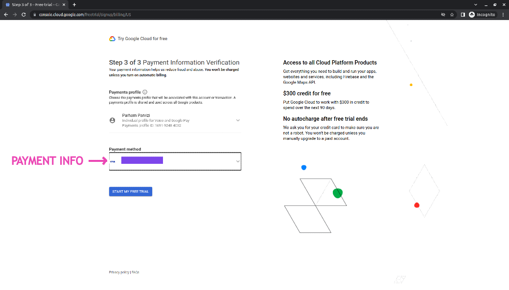
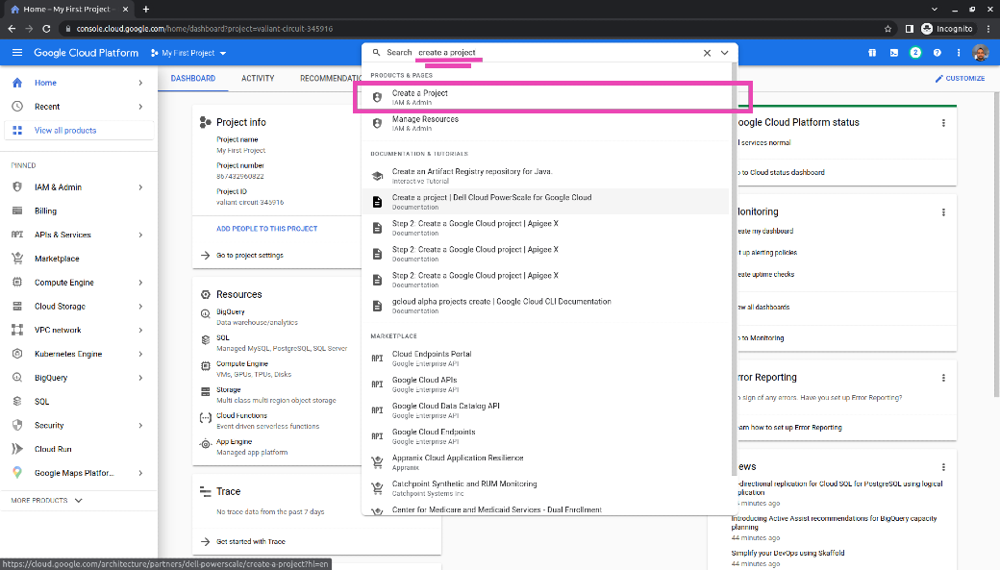
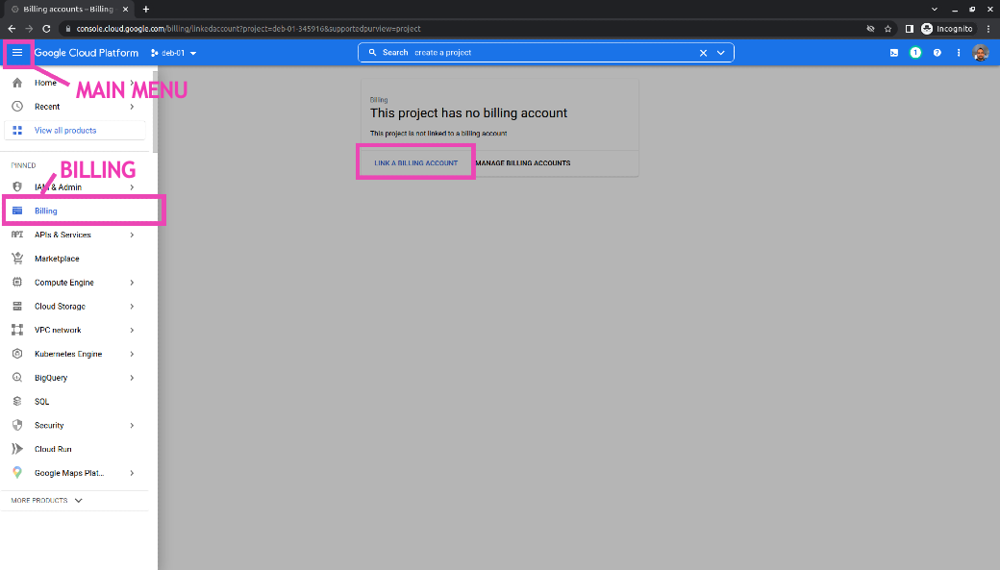
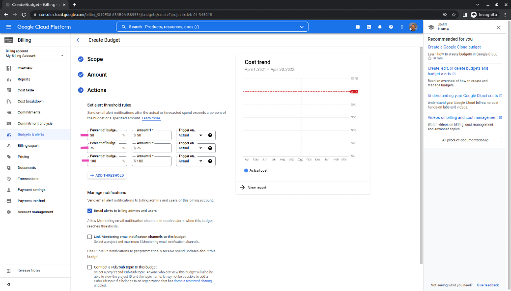
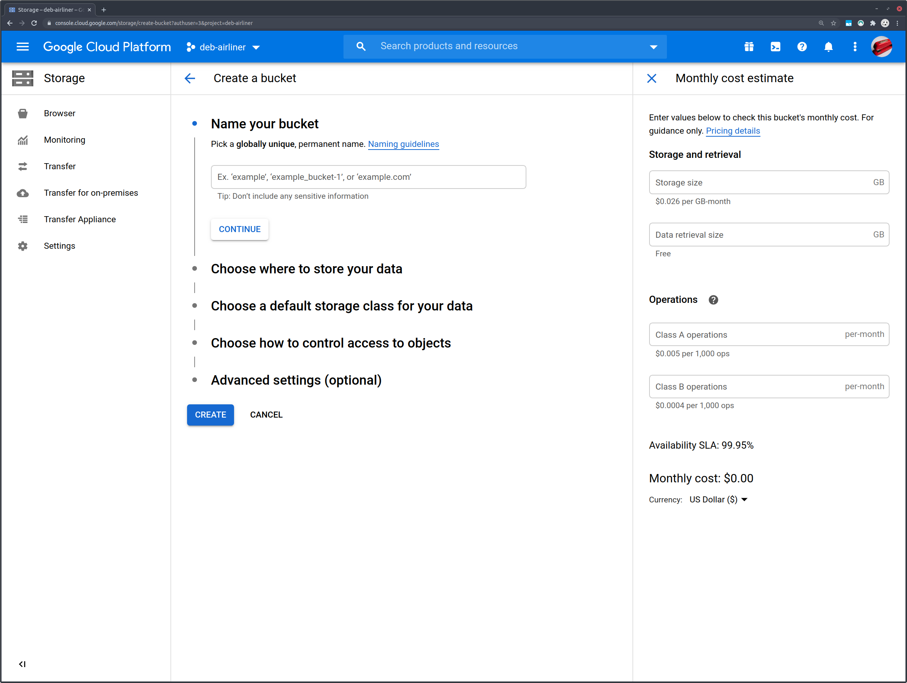
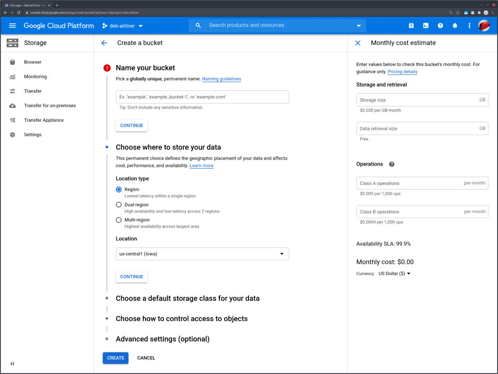
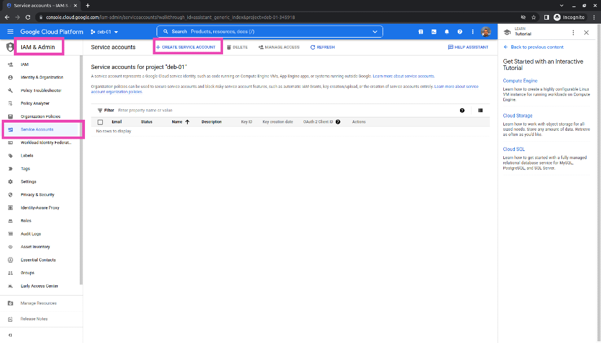
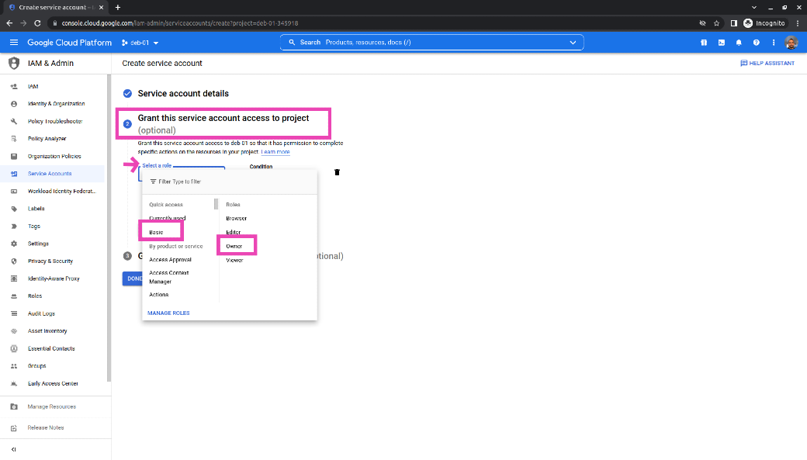
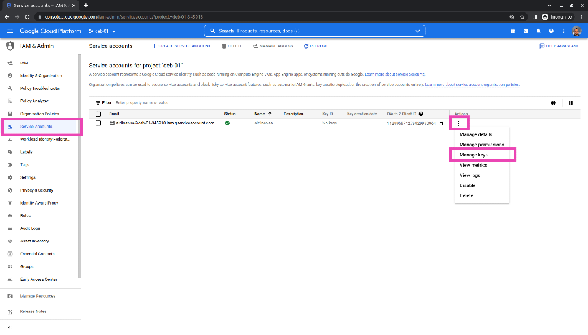

## Overview

Welcome to Data Stack Academy's Data Engineering Bootcamp. 

By the end of this course you will be a well-seasoned Cloud Engineer and learn to use Google Cloud Platform (GCP) services.We have specifically chosen Google Cloud over other cloud platforms because we believe GCP to offer the best combination of services in the data engineering space, and because the GCP services are the closest to their open source Big Data counterparts. Now days, nearly all applications run on cloud.

We believe that we have put together a course curriculum that is second to none. We hope you enjoy this course and we are confident that you will learn the necessary skills to start a rewarding career in Data Engineering.

<br/><br/>

# Setting up your development environment

Before we begin to go through the course material, we need to install and configure all the tools necessary for this course. Data Engineering requires working with a lot of tools; so buckle down and make sure you follow this section completely.

Here's a quick look at what's needed:

1. **\*\*Windows User ONLY\*\*** [Windows Subsystem for Linux (WSL)](#windows-subsystem-for-linux-wsl)

    WSL enables Windows users to run a native Ubuntu bash terminal. This is important since Data Engineers mainly work with Linux environments.

1. [Visual Studio Code](#visual-studio-code-vs-code) (VS Code) & Data Engineering Extensions

2. [Python Setup](#python)

1. [Google Cloud Setup](#google-cloud-setup)

1. [Google Cloud CLI](#install-google-cloud-cli)

1. [Docker](#install-docker)

1. [Getting Started Test](#getting-started-test)

1. [Conclusion - Course Overview](#conclusion---course-overview)

<br/><br/>

## Windows Subsystem for Linux (WSL)

**NOTE:** This section is only for **Windows users only**. Windows Subsystem for Linux (**WSL**) allows Windows users to run Ubuntu Linux natively. This course extensively uses a Unix bash terminal. This allows Windows users to follow along and run bash commands natively.

**NOTE**: Skip this step if you are on Linux or Ubuntu.

<br/>

Follow the instructions for [Windows Subsystem for Linux (WSL) setup](windows-setup.md). After WSL installation, return here and continue the next steps on this guide.

**NOTE:** As Windows users, you will install Python, GCloud command line, and the git repo (below) on your Ubuntu WSL machine. **NOT** your native Windows machine. You're welcome to install these on Windows as well (specially Python); but they run on WSL.

<br/><br/>

## Visual Studio Code (VS Code)

This section will guide through the installation of our favorite IDE (Integrated Development Environment) called **VS Code**.

1. Download and install [VS Code](https://code.visualstudio.com/download)

    **NOTE**: During the last step of the installtion, make sure to check all the boxes to add VS Code to your PATH and Explorer context menu.

1. **Native** Ubuntu users (only) can easily install VS Code via snap:

    ```bash
    sudo snap install code --classic
    ```

VS Code is very powerful since it provides a vast number of **extensions** to work with various development tools and libraries. These extensions make development a whole lot easier. 

### VS Code Extensions

Now, let's add the **top data engineering** extensions:

1. **Open** the Extension Tab on the right or hit `CTRL` + `SHIFT` + `X`
2.  **Search** and **install** the following extensions:

    **MUST HAVE**

    1. [Python](https://marketplace.visualstudio.com/items?itemName=ms-python.python) (by Microsoft)

    2. [Pylance](https://marketplace.visualstudio.com/items?itemName=ms-python.vscode-pylance) (by Microsoft)

    3. [Jupyter](https://marketplace.visualstudio.com/items?itemName=ms-toolsai.jupyter) (by Microsoft)

    4. [Markdown All in One](https://marketplace.visualstudio.com/items?itemName=yzhang.markdown-all-in-one) (by Yu Zhang)

    5. [Docker](https://marketplace.visualstudio.com/items?itemName=ms-azuretools.vscode-docker) (by Microsoft)

    6. [Live Share](https://marketplace.visualstudio.com/items?itemName=MS-vsliveshare.vsliveshare) (by Ritwick Dey)

    7. [Remote Development](https://marketplace.visualstudio.com/items?itemName=ms-vscode-remote.vscode-remote-extensionpack) (by Microsoft)

    8. [MySQL](https://marketplace.visualstudio.com/items?itemName=formulahendry.vscode-mysql) (by Jun Han)

    9. [Cloud Code](https://marketplace.visualstudio.com/items?itemName=GoogleCloudTools.cloudcode) (by Google Cloud)

    **NICE TO HAVE**

    1. [Code Runner](https://marketplace.visualstudio.com/items?itemName=formulahendry.code-runner) (by Jun Han)
    2. [CSV Rainbow](https://marketplace.visualstudio.com/items?itemName=mechatroner.rainbow-csv) (by mechatroner)
    3. [SQLite](https://marketplace.visualstudio.com/items?itemName=alexcvzz.vscode-sqlite) (by alexcvzz)
    4. [Code Spell Checker](https://marketplace.visualstudio.com/items?itemName=streetsidesoftware.code-spell-checker) (by Street Side Software)
   
### VS Code Basics

There are a few **important** keyboard **shortcuts** in VS Code that you must **memorize**:
1. `CTRL` + `SHIFT` + `P`: opens the VS Code command prompt
2. `CTRL` + `P`: opens files from command prompt
3. `CTRL` + `SHIFT` + `F`: searches the entire project
4. `CTRL` + `SHIFT` + `V`: opens a markdown file in preview mode (html formatted)
5. `CTRL` + `` ` ``: toggles the terminal
6. `F5`: starts debugging

### Opening Projects

You can use the **File** menu to open new or existing VSCode projects.

You can also open a project in VS Code from the terminal. This is sometimes useful when you are navigating between project folders and need to quickly view the code in your working directory in VSCode. This works out of the box on Linux and Windows; Mac users follow [this additional step](https://code.visualstudio.com/docs/setup/mac#_launching-from-the-command-line). Then, you can run:

```bash
code .
``` 
and VS Code will open a window with the contents of the current directory.

### Viewing Markdown Files

To read the Markdown instructions files:
1. Open the markdown `.md` file
2. Press `CTRL` + `SHIFT` + `V` 

This renders the markdown file as **HTML** which is a lot easier to read and follow.

<br/><br/>

## Python

<br/>

**NOTE**: WSL users must install python under their WSL Ubuntu terminal. Follow the Ubuntu instructions below. You can additionally install on Windows itself if you prefer to have both.

<br/>

This course is developed for **Python version 3.7**. 

Even though Python 3.9 and 3.10 are currently available, a lot of the dependency packages in this course don't support them. You are free to install other versions (ie: 3.9 or 3.10) but you must have a working version of python 3.7. In fact, it's very common to have multiple versions of Python installed.

Check to see if you already have Python installed

```bash
python3 -V
```

- You can skip this section if you see any version that starts with `3.7.*` (here we have 3.7.13).  
- Don't worry if you see another version or nothing at all. That just means we need to install it.

Follow the instructions below if you do **NOT** have Python 3.7 installed. 

<br/>


We have included installation steps for Mac OS, Ubuntu, and WSL (Windows) below but if you run into issues there are alternative ways:

- The easiest way is to Google "install python3.7 <your operating system>" for example _"install python3.7 ubuntu 20.04"_ or _"install python3.7 Mac OS X"_. Follow the instructions that you find for you operating system.
- You can download python3.7 installers from [python.org](python.org). If you decide to go this way, download and install the highest 3.7 version from python.org.

<br/>

### Ubuntu and Windows WSL

First add the *deadsnake* ppa repos which contain Python3.7 binaries:

```bash
sudo apt-get update
sudo apt-get install software-properties-common
sudo add-apt-repository ppa:deadsnakes/ppa
sudo apt-get update
```

Now, install Python 3.7 along with pip and virtualenv:

```bash 
# install python3.7, pip, and python virtualenv
sudo apt-get install python3.7 python3-pip python3-venv

# upgrade pip and other essential python packages
python3.7 -m pip install --upgrade setuptools pip virtualenv
```

Some users will need to add `pip` to their $PATH. **Skip** this step if you can successfully run this command in a terminal: `pip3 --version`

```bash
printf "\n\n# adding pip to \$PATH\nexport PATH=\$PATH:/home/${USER}/.local/bin" >> ~/.bashrc
source ~/.bashrc
```

### Mac OS

Use brew to install python 3.7, pip, and virtualenv:

```bash
brew install python3.7

# install pip (python package manager)
curl https://bootstrap.pypa.io/get-pip.py -o get-pip.py
python3.7 get-pip.py

# upgrade pip and other essential python packages
python3.7 -m pip install --upgrade setuptools pip virtualenv
```

<br/><br/>

## Jupyter Notebook

Many of the code examples for this course are in [Jupyter notebook](https://ipython.org/ipython-doc/3/notebook/nbformat.html). Jupyter notebooks have become the standard for interactive, collaborative programming and reproducible research. Nearly all data analysts, scientists, and engineers use these notebooks regularly as part of their work.

Installing Jupyter (with pip) is easy and the same across all systems. Simply run:

```bash
pip install jupyterlab
```

Jupyter Notebook uses the file extension of `.ipynb`. We call these file **notebooks**. You work with notebooks in either one of the two options below:
1. [VS Code](#working-with-vs-code)
2. [Jupyter-lab browser-based UI](#working-with-jupyter-lab)

### Working with VS Code

The easiest way to work with notebooks is directly inside VS Code. Make sure you have the VS Code [Jupyter](https://marketplace.visualstudio.com/items?itemName=ms-toolsai.jupyter) extension installed and enabled. Then, simply open `ipynb` files in VS Code. You will later learn [how to run notebooks](/deb/ch1/ep1/README.md#working-with-notebooks-in-vs-code) inside VS Code.

### Working with Jupyter-lab

**NOTE:** This section is completely **optional** for your information only. You can skip this.

Jupyter comes with its own browser-based interface which is often useful. This allows  To run Jupyter Lab:

```bash
jupyter-lab
```

When you run this command, the last line will give you a **URL** to open:


Copy the URL and open it in your browser:


Now, you can use the File menu to open any `ipynb` notebooks in your project. For more details, see the [official Jupyter installation guide](https://jupyter.org/install).

<br/><br/>

## Google Cloud Setup

There are multiple steps in setting up Google Cloud:
1. [Account creation](#create-a-google-cloud-account)
2. [Project creation](#create-a-cloud-project)
3. [Setting a spending budget](#set-a-spending-budget)
4. [Storage bucket creation](#google-cloud-storage-bucket)

<br/>

This course is completely based on **Google Cloud**. Learning Data Engineering on the Cloud is a **huge** advantage. We cannot emphasis this enough. Hopefully, by the end of this course you can pass the Google Cloud certification exam which will give you a big advantage on the job market. 

Google Cloud Platform is commonly abbreviated as **GCP**.

In order to create a GCP account, you must have a **Gmail** account first. [Create a Gmail account](https://accounts.google.com/signup/v2/webcreateaccount?flowName=GlifWebSignIn&flowEntry=SignUp) if you don't have one already.


Google offers a **$300.00** cloud credit to new users. That should be more than enough to finish this course. In fact, most services used here classify under the **free** usage tier. But, Google will ask you to enter a **credit card** information to create the account.

To start your Google Cloud account and use your $300.00 trial credit follow the instructions below.

<br>

### Create a Google Cloud Account 

1. Go to the [Google Cloud Console](console.cloud.google.com) and **login** using your **Google ID**.

2. On the main dashboard click the "TRY FOR FREE" button to activate your $300.00 cloud credit.

    

    If you do **NOT** see this option, you can also access it by choosing **"Billing"** from the menu and navigating to **"Add billing account"**. You should be presented with the option to activate your credit once you start setting up your billing account.

3. Agree to term and conditions and complete the verification process on the next screen.

4. Finish the trial setup by entering your payment information. Don't worry, we will put **guardrails** to notify you if you're getting close to the $300 limit so that you won't have to pay out of pocket.

    

5. Click **"START MY FREE TRIAL"**

<br/>

### Create a Cloud Project

Google automatically creates a project for you called "My First Project". Let's create another one:

1. Enter **"Create a Project"** in the big search bar on top.

    


2. Give your project a descriptive name. Our examples are going to use **"deb-01"** naming. If you choose a project name that's already in use, Google Cloud will add an ID number to the end of it; be aware of this as you're working with your project.


3. Choose a billing account for your project, and create it.


Your _currently active_ project is always displayed on top left corner next to the Google Cloud Platform banner in the **Project Selector**.


4. Open the project Project Selector pop up and make sure to select the project you just created.

    

5. **Optional:** You can Delete the "My First Project" by clicking "Manage" icon. Select the project you like to delete and go through the validation step.

6. Choose **"Billing"** from the main menu on the left. If you see a prompt to **"Link Billing Account"**, go ahead and follow the prompt and link your main billing account called: "My Billing Account".

    **Note:** The billing account may already be linked automatically. In which case don't worry about this step.

    

<br/>

### Set a Spending Budget

Let's make sure we set spending budget and alerts so that we're notified if things start to get our of hand!

1. Choose **"Billing"** from the main menu (on the left) and select **"Budgets & alerts"**.

1. Click **"CREATE BUDGET"**

1. Name the budget **"B-100"**, choose **"Monthly"** time range, AND make sure **"All Projects"** and **"All services"** are selected; then click "NEXT".

    

1. Enter **"$100"** for the budget Amount and click "NEXT".
1. Create three alert levels for 50%, 75%, and 100% of the budget. Make sure the "Email alerts" options is selected. 

    

1. Hit "FINISH"

You will now be notified when you spend over $50, $75, and $100 per month. Be sure to keep an eye out for these emails. You should not reach these limits in our class **unless** you forget to turn off services (per instructed later).

<br/>

### Google Cloud Storage Bucket

Google Storage is a big Cloud storage that's accessible from anywhere in the world. Think of it as a huge distributed hard drive that you can use anywhere. Google Cloud Storage (**GCS**) is the base storage for all other services as well. Other GCloud services (such as BigQuery, Dataflow, or Pub/Sub) can read/write information to GCS; therefore it makes it the ideal place to exchange data between various Cloud services. You're always able to closely manage access to files created on GCS. This will allow you to closely monitor which applications and users can read/write data on GCS.

Files on GCS are organized into **buckets**. A GCS Bucket is uniquely identifiable URL space within GCS. Think of it as the hard drive name that's **globally** and uniquely identifiable. Therefore when you create a new GCS bucket you must insure your bucket name is not used by anyone else in the World. Google will do the check for you.

<br/>

Let's create a GCS bucket that we will use throughout this course:

1. Search for **"Storage"** on the top search box

2. Click on the big blue **"+ CREATE BUCKET"** button on top

3. Choose a bucket name. This has to be globally unique. Do something like: `MY-GOOGLE-ID-deb` or `MY-COOL-NICKMANE-deb`

    
    
4. Remember your bucket name. We're going to use this throughout the course

5. Click next, choose **"Single Region"** for the type and select **"us-central1 (Iowa)"** for your bucket region.

    **Bucket Region**

    You would typically choose a bucket region close to your geographic location to reduce network traffic delays. Although for this course (for simplicity) we're using us-central1.

    

6. Click CONTINUE on the next three screens to accept the default parameters for Storage Class, Access Controls, and Advanced settings.

7. Click CREATE and after a few seconds you should be able to see your bucket

<br/>

### Setup a Service Account

Google Cloud manages user access and controls per project. You can add users and roles to your project by accessing the "IAM & Admin > IAM" from the menu page. This page will show you all the users which can currently access your project. Each user can be assigned various roles to limit their access levels. By default you should always see yourself with the project "Owner" role. The Project Owner is the highest level of access which enables the user to access all resources within a project and assign access to other users.

<br/>

Now, let's add a new **"Service Account"** for this project. A Service Account is an account that's used by your code (APIs and SDKs). You can think of it as a "bot" (robot) account that is not a person.

To create a new Service Account:

1. Click on **"IAM & Admin > Service Accounts"** from the menu bar
2. Click the big **"+ CREATE SERVICE ACCOUNT"** button on top

    

3. Under step 1: Name your service account "airliner-sa" and click "CREATE"
4. Under step 2: Choose either **"Basic > Owner"** OR "Project > Owner" under the **Role** dropdown the click CONTINUE
   
    

5. Under step 3: Leave this step empty as-is and click **DONE**

Now, we need to create a **secret key** for this Service Account. Keys are the secret code that authenticates our code to use Cloud services. You **MUST** always protect this key and never share it with **anyone**. If your key is compromised, hackers can use it to start cloud services and mine for bitcoin on your bill! 

1. From the main **"IAM & Admin > Service Accounts"** select **"Manage keys"** from the airliner-sa **Actions** menu on the right.

    

1. Click **"Add Key"** and **"Create new key"**. Choose **JSON** for the key type and click **CREATE**
2. This will download a JSON file on your computer. **Save** this file in a safe location.

<br/><br/>

## Install Google Cloud CLI

Google Cloud CLI is a series of command line utilities (known as `gcloud`) to access and manage Cloud resources. Being able to use command line effectively builds effective habits that will come very handy on projects. Install and learn to use command line tools like gcloud, gsutil, and bq (bigquery interface) persistently.

<br/>

**NOTE**: **WSL** users should install the CLI under their Ubuntu WSL machine. Follow the instructions for **Debian/Ubuntu** and **NOT** the Windows instructions. You can additionally install the CLI under Windows if you prefer to have both.

<br/>

Follow the Google [**instructions**](https://cloud.google.com/sdk/docs/install-sdk) to install and setup the `gcloud` CLI.

<br/>

After you've installed GCloud SDK, run the init configurations to setup your install:

```bash
gcloud init
```

Link your Google Account and select the deb-01 project, created in the previous steps, as your default project.

To test if things are running smoothly, check to see if you can list your project and GCS storage bucket created in the previous steps:

```bash
gcloud projects list
gsutil ls
```

<br/><br/>

## Install Docker

Docker is a containerization tool. It enables various software such as Databases and Big Data applications to run on your machine (as containers) without going through complex installation processes. Docker is also one of the main technologies used behind the scenes to build Cloud services. We will extensively cover this technology in Chapter 5.

<br/>

**NOTE:** **WSL** users should follow the Docker installation for Windows using **"WSL 2 backend"**. 

<br/>

Follow the [**Docker Installation**](https://docs.docker.com/get-docker/) guide.

<br/>

In order to test your docker install, open a terminal and run:

```bash
docker run hello-world
```

This command should execute without any issues.

<br/><br/>

# Getting Started Test

This section checks to see if you have successfully finished setting up your environment. If everything is working correctly, you should be able finish this section without any issues. **Please** check with your instructor if you have any issues. 

Note: We anticipate most issues to arise from installing WSL. That's normal. 

Open a new bash terminal (or WSL terminal on Windows) and execute the commands below. **Copy** and execute each command **line-by-line**:

```bash
# --------------------------------
# check bash terminal
num=7; if (test $num -gt 5); then echo "bash-test: ok"; else echo "bash-test: failed"; fi


# --------------------------------
# test git 
git --version


# --------------------------------
# test python
python3.7 -V
pip3 -V
python3.7 -c "print('python-test: ok')"


# --------------------------------
# test python virtualenv (venv)
python3.7 -m venv venv
# if the above command doesn't work; then try this:
virtualenv -p python3.7 venv

# activate your venv, test it, deactivate it, and then remove it
source venv/bin/activate
pip install pandas
python -c 'import pandas as pd; print(pd.DataFrame(data={"venv-test": ["ok"]}))'
deactivate
rm -rf venv


# --------------------------------
# test google cloud command line (gcloud)
gcloud version
gcloud info
gcloud projects list
gcloud storage list
gsutil list
bq version


# --------------------------------
# test docker
docker version
docker run hello-world
docker system prune -f 


# --------------------------------
# test vs code
code .

```

<br/><br/>

# Conclusion - Course Overview

Now that you have set up your development environment, please move forward to the [Course Overview](course-overview.md).