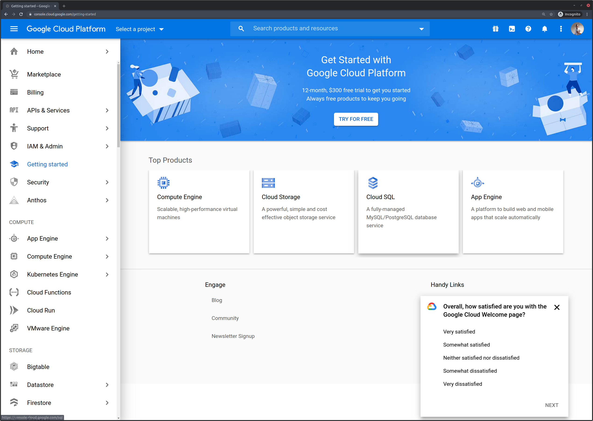
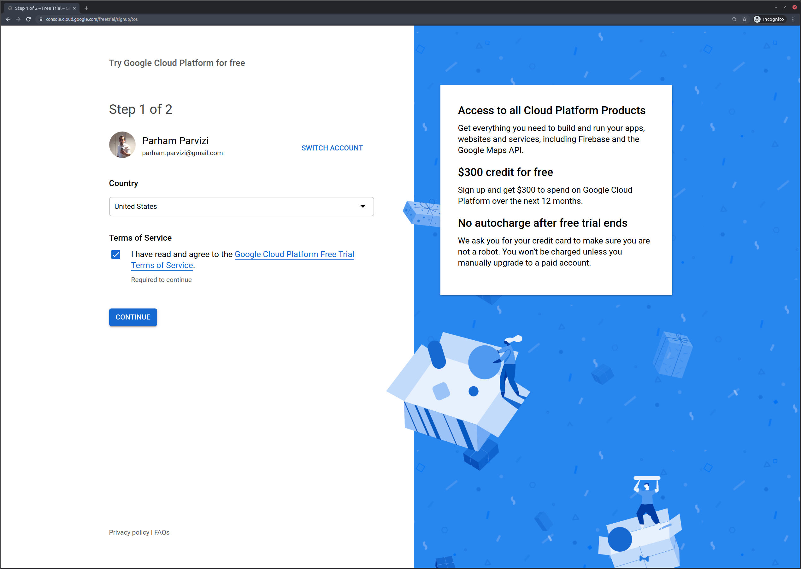
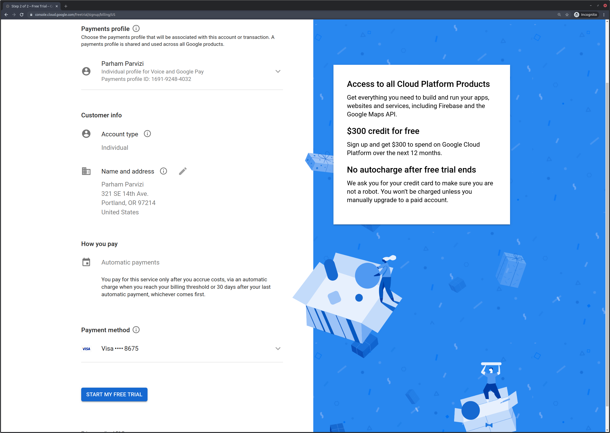

# Getting Started

## Course Overview

Welcome to Data Stack Academy's Data Engineering Bootcamp. By the end of this course you will be a well-seasoned Cloud Engineer. Throughout the course you will learn to use nearly all of Google Cloud Platform (GCP) analytical services. This includes services such as Google BigQuery, Dataflow, Dataproc, Cloud Pub/Sub, Cloud Run, Cloud AI, BigTable, and Cloud Composer.

We have specifically chosen Google Cloud over other cloud platforms because we believe GCP to offer the best combination of services in the data enginering space, and because the GCP services are the closest to their open source Big Data counterparts, such as Apache Hadoop, Hive, Hbase, Spark, Beam, Kafka, Airflow, and more. Learning the material in this course will also prepare you to become a professional Big Data developer.

We believe that we have put together a course curriculum that is second to none. Learning these data and cloud skills will enable you to enter the job market as a modern Data Engineer. These days, nearly all startup companies and applications run on cloud infrastructure and seek to maximize their competitive advantage by leveraging large amounts of data.

We hope you enjoy this course, and are confident that it will teach you all the necessary skills to start a rewarding career in Data Engineering.

## Setting up your development environment

Before we begin to go through the course material, it is important for everyone to set up their development environment so that you can easily access all the resources we will use for this project (code, repository material, cloud resources). Here is an overview of the setup steps:
1. Windows Subsystem for Linux (WSL) install (for Windows users only)
1. Clone the git repository
1. Python setup
1. Google Cloud setup
    - Account creation
    - Project setup
    - Permissions and access
    - Service account configuration
    - Storage bucket configuration
    - Cloud SDK setup
1. IDE setup
### Windows Subsystem for Linux (WSL)

Follow the instructions for [Windows Subsystem for Linux (WSL) setup](windows-setup.md), then return here and continue to follow this guide.

### Git Project

The source code, examples, and answers to exercises on this course are accessible by cloning our Github project. Clone the project (so that you will have your own local copy) under your home directory:

```
cd ~
git clone https://github.com/datastackacademy/data-engineering-bootcamp.git
```

Let's walk through the project folder together. Inside it you should see:

- [data/](data/) contains source data files. You will also use it as an output folder for your scripts and utilize it for storing intermediate files and results. 
- [deb/](deb/) is the main course content folder, and contains all the code samples, instructions, and daily exercises for this course. Code samples are organized into chapters and episodes (ie: deb/ch1/ep2 refers to chapter 1 episode 2). You will be adding your python scripts for each exercise (episode) under these directories; while you can access the finished scripts (the answers) to each episode under /deb/answers.
- [getting-started/] contains introductory and overview material to help new students get quickly oriented and ready to proceed with the rest of the course.

Notice that these directories are organized as python packages. Therefore, make sure you execute your scripts as python modules using the -m option from your project root folder as shown below:
```
python -m deb.ch1.ep2.load_airlines
```
### Python

This course is developed for python 3.7. Even though python 3.8 (and 3.9) is currently available, a lot of the dependency packages used by this course (such as the google cloud components) don't support it. Please make sure that you follow the instructions below to properly install python 3.7.

You can install and use other python versions side-by-side your 3.7 version. That's why we always recommend using a python virtualenv (below).

To check if you have python3.7 installed:
```
python3.7 -V
>> Python 3.7.9
```

Follow the instructions below if you do NOT have Python 3.7 installed.

You can download python3.7 and follow installation instructions from python.org. Feel free to Google complete installation instructions for your operating system. The procedure for installing the correct version of Python depends on your operating system. Below are instructions for installing on each system.

*Do NOT change your default python3 symlink (/usr/bin/python3) under any system. We will be setting up a virtualenv, so there's no need to change your default python link.*

#### Mac OS

User brew to install python 3.7:
```
brew install python3.7
# install/upgrade pip, setuptools, and virtualenv
python3.7 -m pip install --upgrade setuptools pip virtualenv
```

#### Linux (Ubuntu)

First add the *deadsnake* ppa repos which contain Python3.7 binaries:

```
sudo apt update
sudo apt install software-properties-common
sudo add-apt-repository ppa:deadsnakes/ppa
sudo apt update
```
Now, install Python 3.7 along with pip and virtualenv:
```
sudo apt install python3.7
sudo apt install python3-pip
python3.7 -m pip install --upgrade setuptools pip virtualenv
```

#### Windows 10

Follow the instructions for [Windows Subsystem for Linux (WSL) setup](windows-setup.md), then return here and continue to follow this guide.

### Python virtualenv

ALL users MUST setup a python virtualenv (below).

A virtualenv creates an isolated Python environment where you can freely install pip dependency packages on a per-project basis without creating conflicts with the system-wide versions. This allows you to install packages locally for specific applications (ie: this bootcamp) which are only compatible with each other.

Follow the instructions below to create a new python virtualenv and install the python dependency packages used in this course:

```
# go to your project root directory
cd ~/deb
# create a virtualenv called venv
python3.7 -m venv venv
# activate your virtualenv
source venv/bin/activate
# upgrade pip and setup tools (if not done already)
python -m pip install --upgrade pip setuptools
# install python all the dependency packages for this course
pip install -r requirements.txt
# check to see if all packages are installed correctly:
pip freeze
```

### Installing Jupyter

Many of the code examples for this course are in [Jupyter notebook format](https://ipython.org/ipython-doc/3/notebook/nbformat.html). Jupyter notebooks have become the standard for interactive, collaborative programming and reproducible research. Nearly all data analysts, scientists, and engineers use these notebooks regularly as part of their work.

Installing Jupyter (with pip) is easy and the same across all systems. Simply run:
```
pip install jupyterlab
```

Once the installation finishes, you can launch Jupyter with:
```
jupyter-lab
```

Note that the name of the python package ('jupyterlab') and the name of the Jupyter binary executable ('jupyter-lab') are slightly different.

When you run Jupyter, it will give you a link to open its its browser-based interface, which lets you explore files and open and compose notebooks:


Copying and pasting one of those links into your browser will bring up the interface:


Navigate to the project folder containing your local copy of the git repository for the course, and go to the deb/ch/ep1/ folder. Open one of the .ipynb notebook files in Jupyter and make sure that you can view it. From time to time in this course, we will make use of the ability to run code interactively in Jupyter notebooks. We'll talk more about then when we get a bit farther along. For now, just make sure that Jupyter is installed and that you know how to run it.

For more details, see the [official Jupyter installation guide](https://jupyter.org/install).

<br>
### Google Cloud setup

This course primarily uses Google Cloud technologies such as BigQuery, Cloud Dataflow, Cloud Dataproc, Cloud Pb/Sub, and many more. Google offers a $300.00 cloud credit to start using their service. All the cloud services used by this course are easily covered by this credit (in fact most services used in this course classify under Google's free tier usage).

To start your Google Cloud account and use your $300.00 trial credit follow the instructions below.

<br>

#### Google Account Creation

1. Go to console.cloud.google.com and log in using your google ID.
2. On the main dashboard click the "TRY FOR FREE" button to activate your $300.00 cloud credit.

If you do not see this option, you can also access it by choosing "Billing" from the menu and navigating to "Add billing account". You should be presented with the option to activate your credit once you start setting up your billing account.



3. Agree to term and conditions on the next screen and click continue.



4. Finish the trial setup on the next screen by entering your payment information. Don't worry this course will not exceed the $300.00 credit. You can always keep an eye out on your spending by going through the "Billing" menu option.



> Google Cloud Project Selector
>Your current project is always displayed on top left corner next to the >menu icon. Always make sure you are using the correct project while using >Google Cloud.

### Google Cloud Access

Google Cloud manages user access and controls per project. You can add users and roles to your project by accessing the "IAM & Admin > IAM" from the menu page. This page will show you all the users which can currently access your project. Each user can be assigned various roles to limit their access levels. By default you should always see yourself with the project "Owner" role. The Project Owner is the highest level of access which enables the user to access all resources within a project and assign access to other users.

Play around with this panel. You can click the "+ADD" button on top. This panel lets you assign access to friends or colleagues with a valid Google ID. Explore the roles. You can add multiple roles to a user. Each google resource typically has "Owner", "Viewer", and "Editor" roles. For example "BigQuery Data Viewer" would allow a user to view dataset within Google BigQuery (Google's analytical SQL query engine) and so on.

Click around, but you don't have to assign any roles at this point. Just make sure you see your name with project "Owner" role.

What we do need to create is a "Service Account" for this project. A Service Account is an account that's used by API or SDK and does NOT require a Google ID associated with it. Service accounts create a credential file that's used by APIs or SDKs while connecting to Google API. We will use this service account with our python code throughout the course.

To create a new Service Account:

1. Click on IAM & Admin > Service Accounts from the menu bar
1. Click the big "+ CREATE SERVICE ACCOUNT" button on top
1. Name your service account "airliner-sa", short for airliner service account and click CREATE.
1. You can assign roles to a service account just like regular members as mentioned above.
1. From the Role drop down selector choose Project > Owner and click Continue. You can play with other more specific roles, but for now we recommend that you choose the Owner role.
1. Once the service account is created, click the "..." Actions picker from its menu and select "Create Key" option. This option will allow you to generate credential files that are used by SDK packages (such as python) to use the Cloud services.


7. Choose the JSON option and save the file as airliner-sa.json under ~/deb/creds folder. This is the creds/ folder of your git project from above. Make sure you do NOT loose this file. You will not be able to recreate the file; but you can always generate a new key following the same steps.

*Follow the next step to configure the JSON key file to be correctly accessed by SDKs.*

#### Configuring the Service Account for SDKs

Now that you have the service account key file, you must configure it to be used by SDKs (such as python). Google SDK packages search a local environment variable called GOOGLE_APPLICATION_CREDENTIALS for the location of the key file. Set this variable to the full path where we stored the key file from previous step:

```
cd ~/deb
export GOOGLE_APPLICATION_CREDENTIALS=$(pwd)/creds/airliner-sa.json
```
In order to avoid running this command every time you want to use the SDKs, you can add the export command (above) to your ~/.bashrc script. Remember to source ~/.bashrc if you're running this for the first time.

>setting GOOGLE_APPLICATION_CREDENTIALS
>Remember GOOGLE_APPLICATION_CREDENTIALS environment variable Whenever >you're trying to run your python code and all the sudden you get strange >errors from the Cloud SDK, remember to check if you've set this correctly. >It happens all the time, that's why we suggest setting this in your .bashrc.

#### Google Cloud Storage Bucket

Google Storage is a big Cloud storage that's accessible from anywhere in the world. Think of it as a huge distributed hard drive that you can use anywhere. Google Cloud Storage (GCS) is the base storage for all other services as well. Other GCloud services (such as BigQuery, Dataflow, or Pub/Sub) can read/write information to GCS; therefore it makes it the ideal place to exchange data between various Cloud services. You're always able to closely manage access to files created on GCS. This will allow you to closely monitor which applications and users can read/write data on GCS.

Files on GCS are organized into *buckets*. A GCS Bucket is uniquely identifiable URL space within GCS. Think of it as the hard drive name that's globally and uniquely identifiable. Therefore when you create a new GCS bucket you must insure your bucket name is not used by anyone else in the World. Google will do the check for you. An easy way to insure that your name is unique is to include a domain name, like turalabs.com, if you have one registered. We'll try this below.

Let's create a GCS bucket that we will use throughout this course:

1. Search for "Storage" on the top search box of Google Cloud Console

2. Click on the big blue "+ CREATE BUCKET" button on top

3. Choose a bucket name. This has to be globally unique. Do something like "\<YOUR-GOOGLE-ID\>-deb"

>*Registering Domain Names*
>If you have a domain name (like turalabs.com) registered, try using it >like: "deb.gcs.turalabs.com". The dialog will prompt you to verify your >domain, follow the instructions and you'll be able to use your domain to >insure unique bucket names. This is a very useful way to name your >buckets.


    
1. Remember your bucket name. We're going to use this throughout the course

2. Click next, choose "Single Region" for the type and select "us-central1 (Iowa)" for your bucket region.

*Bucket Region*
>Typically, you can choose a bucket region close to your geographic >location to reduce network traffic delays. Although for this course (for >simplicity) we're using us-central1. This is also because all the Google >service features used in this course are currently offered in this region >(such as BigQuery external tables).

~[GCS bucket creation instructions](gcs-bucket_region.png)

1. Click CONTINUE on the next three screens to accept the default parameters for Storage Class, Access Controls, and Advanced settings.

2. Click CREATE and after a few seconds you should be able to see your bucket

3. Edit your ~/deb/.env file and change DEB_BUCKET_NAME to your bucket name. 

>*DEB_BUCKET_NAME*
>We will use DEB_BUCKET_NAME environment variable later in this course to >insure scripts run correctly with your unique bucket name.

Installing Google Cloud SDK

Google Cloud SDK is a series of command line utilities to access and manage Cloud resources. Being able to use command line effectively builds nice habbits that will come very handy on projects. Install and learn to use command line tools like gcloud, gsutil, and bq (bigquery interface) persistently.

GCloud Installation and [Getting Started Guide](https://cloud.google.com/sdk/docs/quickstarts) is available for all operating systems:

- [Quickstart for MacOS](https://cloud.google.com/sdk/docs/quickstart-macos)
- [Quickstart for Windows](https://cloud.google.com/sdk/docs/quickstart-windows)
- [Quickstart for Debian and Ubuntu](https://cloud.google.com/sdk/docs/quickstart-debian-ubuntu)
- [Quickstart for Redhat and CentOS](https://cloud.google.com/sdk/docs/quickstart-redhat-centos)
- [Quickstart for Linux](https://cloud.google.com/sdk/docs/quickstart-linux)

>*Using Windows*
>If you're using Windows, we highly recommend enabling Windows WSL (Windows >Subsystem for Linux) and installing Ubuntu. Once you have your WSL Ubuntu >install running, you can use the quickstart link above for Ubuntu.

After you've installed GCloud SDK, run the init configurations to setup your install:

```
gcloud init
```

Link your Google Account and select the deb-01 project, created in the previous steps, as your default project.

To test if things are running smoothly, check to see if you can list the GCS bucket and project created from our previous step:

```
gsutil ls
gcloud projects list
# you should be able to see your project and bucket listed
```

### IDE Setup

This section will give you a couple options to install and use our favorite IDEs. Feel free to use whichever one works best for you. In short:

- VS Code is much more lean and easier to get started
- PyCharm is feature rich and better suited for someone who's gonna be coding a lot in Python

We recommend VSCode for the data engineering workflow demonstrated in this course, but some people prefer PyCharm, and it is very useful for those doing a lot of Python work.

#### Microsoft Virtual Studio Code (VSCode)

VS Code

1. Download and install Visual Studio (VS) Code
    - For Ubuntu users, you can easily install VS Code via snap:
        ```
        sudo snap install code --classic
        ```
2. Once you have VS Code installed and started up, add the Python Extension. Go to the extensions tab by clicking this icon:

We recommend installing a few very helpful extensions that will make your workflow much more productive.
    - Python extension: search for 'ms-python.python'. Click on the extension and install it. This contains support for python itself, linting (style checking), notebooks, and much more.
    - MySQL extension: search for 'mysql'. There are two extensions with the same name; select the one by author Jan Hun. Click to install.
    - Jupyter extension (search for 'Jupyter')
    - Github (search for 'github'). You won't be doing a lot of contribution to the git repository for this course, but having git/github integration set up in your IDE will be indispensable for when you starting working as a data engineer.
3. Navigate to project folder where you want to clone the deb project from our previous step
4. If you have already created a virtualenv in python setup, you can click the python version icon in the bottom left side of the VS Code window and select it using the drop down menu.

>If you prefer to use a terminal, you can open an inline terminal by >pressing >`ctrl+``. Use the following command to activate the virtual >environment.
>```
>source [VENV FOLDER NAME]/bin/activate
>```

Once your virtualenv is activated, you can can use pip to install the project dependencies:
```
pip install -r requirements.txt
```

VS Code has a built in Source Control interface for git. To stage and create commits, navigate to the Source Control tab by clicking on the Source Control icon, and add the files you would like to stage and commit.To change branches or create a new branch, you can click on the Git Branch icon at thebottom right of the VS code window.

VS Code has a huge number of official and community extensions, so you can customize your coding environment to your heart's content.
