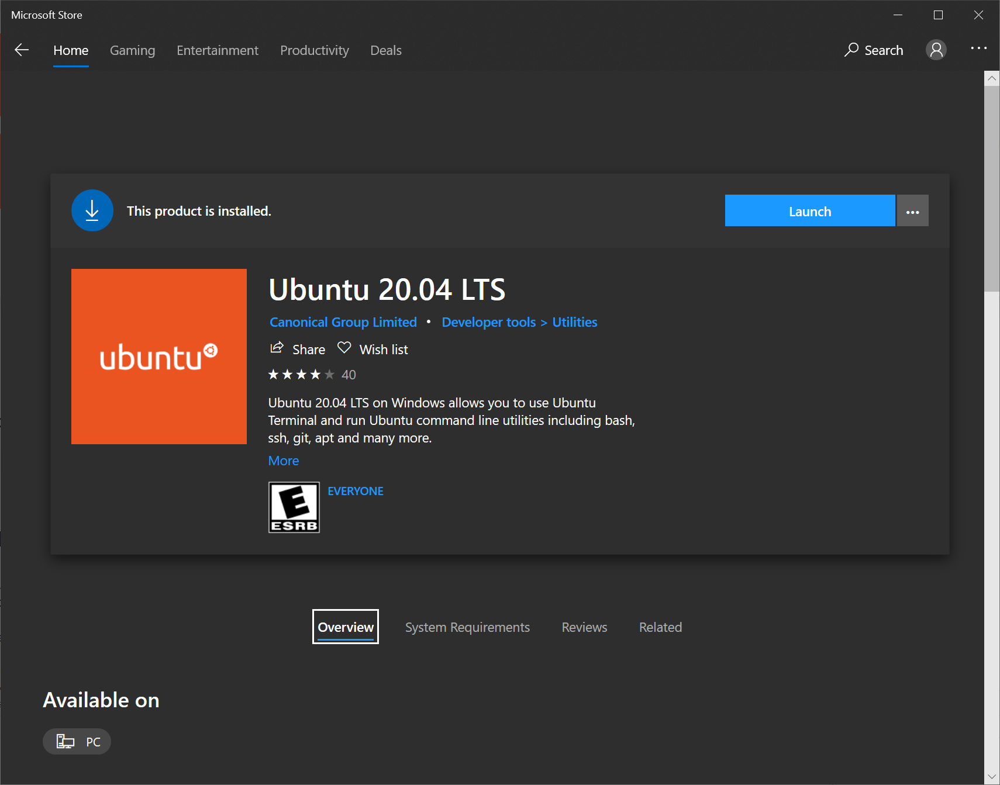

# Windows Subsystem for Linux (WSL) Setup

You can use your choice of operating system throughout this course - Linux, Mac OS, or Windows. But the execution scripts and command line examples are written for a Unix-style bash shell, so Windows users will need to install [Windows Subsystem for Linux](https://docs.microsoft.com/en-us/windows/wsl/about) (WSL), which lets you run a Linux environment directly on Windows without needing a virtual machine or a dual-boot setup. The following instructions will walk you through installing WSL.

## Enabling WSL 2

First, follow the [official install guide](https://docs.microsoft.com/en-us/windows/wsl/install) to install WSL 2.

>**Running a Windows Build Older than 18362**
>If you are running a Windows Build lower than 18362, before enabling WSL 2 you must upgrade Windows using Windows Update Assistant. To find your Windows Build info, hit the Windows key and type 'System Information'. (At the time of this writing, the latest build is 10.0.19041)

> **Window 11**
>Some users are reporting issues with WSL when upgrading to Windows 11, with no clear fix yet. The links below might help you troubleshoot the problem. If you experience this, please let the instructor know, and we can take a look at your specific installation:
- [WSL File System Error # 1](https://github.com/microsoft/WSL/issues/7435)
- [WSL File System Error # 2](https://github.com/microsoft/WSL/issues/5456)

## Installing Ubuntu 

Once you have WSL installed, you can install Ubuntu 20.04, which is our recommended Linux distribution:

**[Install Ubuntu from the Microsoft store](https://www.microsoft.com/en-us/p/ubuntu-2004-lts/9n6svws3rx71?activetab=pivot:overviewtab)**



<BR>

Once you have Ubuntu installed on your WSL, you should update your Ubuntu install:
1. Start a new terminal from the Start menu 
2. You will be prompted to choose a root password. Make sure to remember it (we recommend using a password manager like [LastPass](lastpass.com) or [BitWarden](bitwarden.com))
3. Run the following commands to update and upgrade Ubuntu:
```
sudo apt update
sudo apt -y upgrade
```

>You MUST first update/upgrade Ubuntu before you can properly install and run Python


## Accessing Windows files

To easily access your Windows files, setup symlinks to your Windows directories. Your entire Windows C:\ Drive is mounted on Ubuntu under /mnt/c. The instructions below create symlinks to access your Windows's Home directory from Ubuntu:

```
cd ~
# change {%USER NAME} with your user name
ln -s /mnt/c/Users/{%USER NAME} ms-home
ls -l
```

That completes setup of WSL. Make sure that you finish going through the [Getting Started Guide](README.md) to set up your python environment and get access to GCP and the project resources we will use for the course.
### Further Reading
- [WSL Install docs](https://docs.microsoft.com/en-us/windows/wsl/install) (microsoft.com)